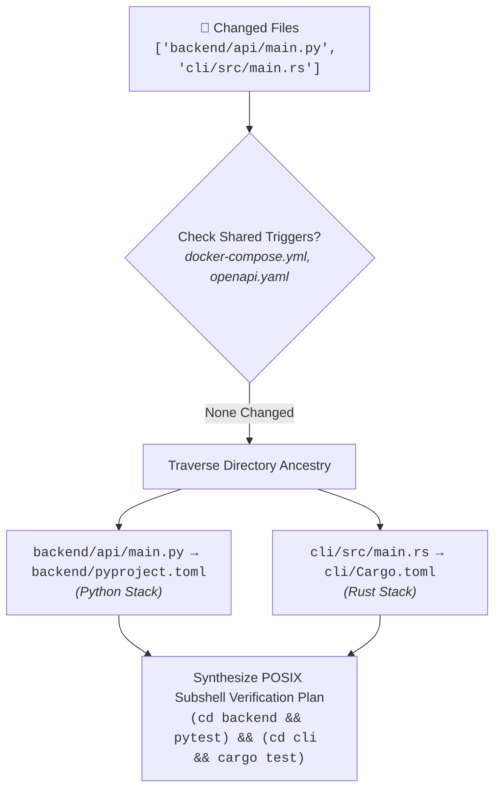

<div align="center">

# 🚀 jules-orchestrator-kit

### Universal Autonomous AI Agent Orchestration Kernel for Google Jules

<br/>

[](https://github.com/FullThrottle83/jules-orchestrator-kit/actions/workflows/jules-audit.yml)
[](https://www.npmjs.com/package/jules-orchestrator-kit)
[](https://opensource.org/licenses/MIT)
[](https://nodejs.org)
[](https://nodejs.org)

<br/>

<p align="center">
  <b>The zero-dependency safety gatekeeper and self-healing engineering kernel for autonomous coding agent swarms.</b>
  Transforms single-turn AI chat assistants into production-grade engineering swarms running 300+ daily sessions across any language or monorepo.
</p>

<br/>

<p align="center">
  <a href="#what-is-kit">💡&nbsp;What&nbsp;is&nbsp;Kit?</a> &nbsp;•&nbsp;
  <a href="#quickstart">⚡&nbsp;Quickstart</a> &nbsp;•&nbsp;
  <a href="#triage-guidelines">🎯&nbsp;Triage&nbsp;Guidelines</a> &nbsp;•&nbsp;
  <a href="#matrix">📊&nbsp;Matrix</a>
  <br/>
  <a href="#architecture">🏛️&nbsp;Architecture</a> &nbsp;•&nbsp;
  <a href="#cli-docs">🛠️&nbsp;CLI&nbsp;Docs</a> &nbsp;•&nbsp;
  <a href="#roadmap">🗺️&nbsp;Roadmap</a>
</p>

</div>

<br/>

---

<br/>

<a id="what-is-kit"></a>
## 💡 2-Sentence Mental Model

> [!TIP]
> **Think of `jules-orchestrator-kit` as an automated Engineering Manager for AI coding agents.**  
> It hands out clear tasks, runs your tests in an isolated sandbox, fixes broken code automatically, and only opens a Pull Request when 100% of your tests pass.

<br/>

---

<br/>

## 🎯 Why `jules-orchestrator-kit`?

Autonomous coding agents can write software at 100× human speed—but unconstrained agents introduce silent regressions, leak API keys, hallucinate test assertions, and thrash shared monorepos.

`jules-orchestrator-kit` provides the missing **Safety, Orchestration, and Verification Kernel** for high-reliability AI agent deployments:

* **🔒 Zero Runtime Dependencies:** Built exclusively on Node.js 20+ built-ins (`node:fs`, `node:child_process`, `node:crypto`, `node:path`, `node:http`, `node:test`). Zero third-party npm packages mean zero supply-chain CVE risk.

* **🛡️ Fail-Closed Security Gatekeeper:** Unconditionally evaluates explicit Deny rules *before* Allow rules, redacts high-entropy secrets and PII from dry-runs and git diffs, and rejects PRs exceeding the 75 KB Diff Payload governor.

* **🔄 Autonomous OODA Self-Healing:** Captures test stderr/stdout, normalizes failure fingerprints, and feeds structured error contexts back into repair iterations (up to 3 automatic attempts) before human escalation.

* **🌐 Universal Polyglot Spine:** Natively auto-detects 24+ tech stacks (PHP/Laravel/WordPress, .NET/C#, Python, Go, Rust, C/C++, Flutter/Swift, Node/Deno/Bun) and transparently wraps verification suites in Docker Compose or Devcontainer sandboxes.

* **📂 Scoped Monorepo Boundary Resolver:** Statically maps changed files up directory ancestry to invoke isolated subshell test suites (`(cd backend && pytest) && (cd cli && cargo test)`), eliminating global test thrashing.

* **🚀 Zero-Test Bootstrapping (`agentctl bootstrap`):** Synthesizes deterministic syntax-check and smoke-test verification oracles for untested legacy repositories so agents always operate against a falsifiable feedback loop.

* **📈 Proven Scale & Reliability:** Empirically tested with **224 unit tests across 55 suites passing in < 1.2s**, supporting 300+ daily agent sessions per repository.

<br/>

---

<br/>

<a id="triage-guidelines"></a>
## 🎯 Triage Guidelines: When to Use vs. When NOT to Use

To ensure maximum merge success, dispatch tasks according to our deterministic triage boundaries:

<br/>

### 🟢 Ideal Tasks for Autonomous Swarms

* ✅ **Scoped Code Changes & Bug Fixes:** Well-defined objectives mechanically verifiable via unit tests (`npm test`, `pytest`, `cargo test`, `dotnet test`).
* ✅ **Type & Linter Migrations:** TypeScript strict mode fixes, PHP 8.3 type hint additions, or Python MyPy type annotation passes.
* ✅ **Dependency Bumps & Security Audits:** Remediating CVEs in lockfiles (`package.json`, `Cargo.toml`, `composer.json`) with hermetic test verification.
* ✅ **Refactoring Legacy Codebases:** Modularizing backend routes, API controllers, or database query layers.
* ✅ **Visual & E2E Testing (via Playwright):** UI changes paired with automated headless Playwright snapshot tests (`npx playwright test`).

<br/>

### 🔴 When NOT to Use (Out of Scope)

* ❌ **Unverifiable Visual UI Tweaks:** Pixel-perfect CSS/Tailwind adjustments lacking automated visual regression tests (agents cannot "see" raw browser output without Playwright).
* ❌ **Closed Proprietary Platforms Without CLI:** Systems lacking local CLI tools or git repositories (e.g., Salesforce, Webflow, closed SAP backends).
* ❌ **Unmocked Live Cloud Systems:** Code requiring live connections to 10+ external cloud APIs without local emulators or mocks.
* ❌ **Protected Infrastructure Paths:** Direct edits to `.github/workflows/`, production deployment keys, or agent security gate rules (enforced fail-closed by `Agent Scope Guard`).

<br/>

---

<br/>

<a id="matrix"></a>
## 📊 Feature Comparison Matrix

| Dimension | Raw Agent Execution (No Orchestrator) | Standard CI/CD Pipelines | `jules-orchestrator-kit` (v0.27+) |
| :--- | :--- | :--- | :--- |
| **Self-Healing Loop** | ❌ None (Crashes on test error) | ❌ None (Fails build; notifies human) | ✅ **Autonomous OODA Loop** (Max 3 repair turns with error fingerprinting) |
| **Scope Isolation** | ❌ None (Can modify CI files or lockfiles) | 🟡 Post-commit branch rules only | ✅ **Fail-Closed Scope Guard** (Deny-first evaluation; blocks protected paths) |
| **Polyglot Stack Detection**| ❌ Manual prompt instructions | 🟡 Hardcoded YAML workflow steps | ✅ **Universal 24+ Stack Detector** (`src/stack-detector.mjs`) |
| **Flaky Test Quarantine** | ❌ Fails session randomly | ❌ Breaks CI pipeline randomly | ✅ **Wilson-Score Statistical Quarantine** (Oscillation ≥ 0.40 quarantined automatically) |
| **Monorepo Scoping** | ❌ Runs full global test suite | 🟡 Requires custom Nx/Turbo scripting | ✅ **Scoped Subshell Boundary Resolver** (`resolveWorkspaceBoundary`) |
| **Zero-Test Bootstrapping**| ❌ Halts without verification oracle | ❌ Fails build if no tests exist | ✅ **Instant Oracle Synthesis** (`php -l`, `compileall`, `dotnet build`, `tsc`, `smoke`) |
| **Secret Leak Prevention**| ❌ Prone to leaking tokens in diffs | 🟡 Post-push secret scanning alerts | ✅ **Pre-Dispatch & Pre-Commit Diff Scanner** (Blocks CVEs/keys before PR creation) |
| **Dependency Footprint** | ❌ Requires heavy SDKs & parsers | 🟡 Many external actions & plugins | ✅ **0 Native Dependencies** (100% Node.js 20+ ESM built-ins) |

<br/>

---

<br/>

<a id="quickstart"></a>
## ⚡ Universal 30-Second Quickstart (Zero to Verified PR)

Get from zero to an autonomously verified GitHub Pull Request across any software ecosystem in 30 seconds.

<br/>

### 1️⃣ Node.js / TypeScript (npm, pnpm, yarn, bun, deno)
```bash
# Dispatch a scoped task; auto-detects package.json / tsconfig.json and runs type-checked tests
npx jules-orchestrator-kit dispatch --title "Add rate limiting to API router" \
  --prompt "Implement IP-based token-bucket rate limiting in src/router.ts with unit tests."
```

<br/>

### 2️⃣ Python / FastAPI / Django (pytest, pyproject.toml)
```bash
# Bootstrap zero-test or legacy Python repo, then dispatch task
npx jules-orchestrator-kit bootstrap --force
npx jules-orchestrator-kit dispatch --title "Add OAuth2 JWT validation" \
  --prompt "Add JWT bearer authentication middleware to backend/api/auth.py and verify via pytest."
```

<br/>

### 3️⃣ PHP / Laravel / WordPress (Docker Compose + PHPUnit/Pest)
```bash
# Auto-detects docker-compose.yml and wraps test commands in `docker compose exec -T app ...`
npx jules-orchestrator-kit dispatch --title "Upgrade PHP 8.3 type annotations" \
  --prompt "Add strict type hints to all repository classes in app/Repositories/."
```

<br/>

### 4️⃣ .NET / C# Enterprise (*.sln, *.csproj)
```bash
# Auto-detects .sln / .csproj and runs `dotnet test --no-restore --nologo`
npx jules-orchestrator-kit dispatch --title "Implement OrderService caching" \
  --prompt "Add IMemoryCache caching to OrderService.cs with xUnit coverage."
```

<br/>

### 5️⃣ UI / Frontend E2E (Playwright)
```bash
# Dispatch frontend task verified via headless Playwright E2E tests
npx jules-orchestrator-kit dispatch --title "Add Dark Mode Toggle Component" \
  --prompt "Create ThemeToggle component in src/components/ThemeToggle.tsx and verify via npx playwright test."
```

<br/>

### 6️⃣ Polyglot Monorepo (FastAPI + React + Rust CLI)
```bash
# Run a parallel worktree swarm; changed files automatically route to scoped subproject tests
npx jules-orchestrator-kit swarm
```

<br/>

<details>
<summary><b>🔍 View All 24+ Supported Ecosystems & Stack Triggers</b></summary>

<br/>

```
Ecosystems Natively Supported by src/stack-detector.mjs:
├── PHP / Laravel / WordPress (composer.json, phpunit.xml, pest.php, artisan, wp-cli.yml)
├── .NET / C# / F# (*.sln, *.csproj, *.fsproj, global.json)
├── Mobile / Dart / Flutter (pubspec.yaml)
├── Mobile / Swift / Xcode (Package.swift)
├── Mobile / React Native (app.json, react-native.config.js)
├── Systems / CMake (CMakeLists.txt)
├── Systems / Rust Cargo (Cargo.toml)
├── Systems / Go (go.mod)
├── Systems / Make (Makefile)
├── Python / FastAPI / Django (pyproject.toml, requirements.txt, setup.py)
├── Elixir / Phoenix (mix.exs)
├── Ruby / Rails (Gemfile)
├── Java / Maven (pom.xml)
├── Java / Gradle (build.gradle, build.gradle.kts)
├── JS / TS Workspaces (turbo.json, pnpm-workspace.yaml, nx.json)
├── JS / TS Runtimes (bunfig.toml, deno.json, package.json)
└── Devcontainers & Docker Compose (.devcontainer/devcontainer.json, docker-compose.yml, Dockerfile)
```

</details>

<br/>

---

<br/>

<a id="architecture"></a>
## 🏛️ System Architecture & Visual Diagrams

<br/>

### 1. The Autonomous OODA Verification Loop
Every task dispatched to `jules-orchestrator-kit` executes within an immutable, fail-closed verification loop:

```mermaid
flowchart TD
    A["📩 Task Envelope"] --> B["1. Validate Scope & Base Freshness"]
    B --> C["2. Create Isolated Git Worktree & VFS Lock"]
    C --> D["3. Dispatch Task to Google Jules / LLM"]
    D --> E["4. Execute Scoped Verification Gate<br/><code>detectPolyglotStack().testCmd</code>"]
    
    E -->|PASS| F["5. Security Audit<br/><i>Redact Secrets, Diff < 75KB</i>"]
    F --> G["7. Rebase & Open PR<br/><code>git rebase main && gh pr create</code>"]

    E -->|FAIL| H["6. Fingerprint Stderr & Flaky Verdict"]
    H -->|Oscillation >= 0.40| I["🚨 Quarantined Test<br/><i>Exit Code 8</i>"]
    H -->|Normal Failure| J["🔄 Attempt OODA Repair Turn<br/><i>Max 3 Retries; Exit 4 on Exhaust</i>"]
    J --> D
```



<br/>

### 2. Polyglot Monorepo Scoped Execution Engine
In monorepos containing multiple languages, `resolveWorkspaceBoundary(changedFiles)` traverses directory ancestry to isolate verification to affected subprojects:



<br/>

---

<br/>

<a id="cli-docs"></a>
## 🛠️ CLI Command Reference (`agentctl`)

`agentctl` is the unified command-line interface for `jules-orchestrator-kit`, available via `bin/agentctl.mjs` or `npx jules-orchestrator-kit <command>`.

<br/>

| Command | Usage | Description | Exit Codes |
| :--- | :--- | :--- | :--- |
| `dispatch` | `agentctl dispatch --title <t> --prompt <p>` | Dispatches a single task to an AI agent in an isolated worktree. | `0` (Success), `1` (Arg error), `2` (429 Rate limit), `3` (Scope deny), `4` (OODA exhausted), `5` (Diff > 75KB), `6` (Secret leak) |
| `review-repair`| `agentctl review-repair <pr-comments.json>`| Parses GitHub PR review comments and synthesizes actionable OODA repair tasks. | `0` (Parsed), `1` (Missing file) |
| `dashboard` | `agentctl dashboard [port]` | Starts zero-dependency local HTTP telemetry and audit visualizer dashboard. | `0` (Running) |
| `gate` / `audit`| `agentctl gate --base main --json` | Runs security, secret scanning, and verification gate against current branch. | `0` (Approved), `3` (Scope violation), `5` (Diff limit), `6` (Secret leak) |
| `bootstrap` | `agentctl bootstrap [--force] [--json]` | Inspects an untested repository and synthesizes `.agent/config.yml` with a zero-test verification oracle (`php -l`, `compileall`, `dotnet build`, `tsc`, `smoke`). | `0` (Bootstrapped / Existing) |
| `queue` | `agentctl queue` | Consumes and executes pending markdown task envelopes in `.agent/queue/`. | `0` (Complete) |
| `swarm` | `agentctl swarm` | Runs parallel multi-agent swarm across queued tasks with token-bucket concurrency. | `0` (Complete) |
| `doctor` | `agentctl doctor` | Diagnostic inspect: displays detected stack, container wrapper, test command, and daily session budget. | `0` (Healthy) |
| `lock` | `agentctl lock <acquire\|release\|status>`| Manages VFS mutex locks for multi-agent non-overlapping file ownership. | `0` (Locked/Released), `1` (Conflict) |
| `clean` | `agentctl clean` | Prunes stale git worktrees, lockfiles, and temporary ledgers. | `0` (Clean) |
| `init` | `agentctl init` | Scaffolds `.agent/` directory structure and default `.agent/config.yml`. | `0` (Created) |
| `mcp` | `agentctl mcp` | Starts stdio Model Context Protocol (MCP) server for tool integration. | `0` / Stdio stream |
| `version` | `agentctl version` | Outputs orchestrator kit semantic version (`v0.27.0`). | `0` |

<br/>

---

<br/>

<a id="roadmap"></a>
## 🗺️ v0.27+ Next-Gen Feature Roadmap

| Feature | Module / Command | Architectural Blueprint | Target Release |
| :--- | :--- | :--- | :---: |
| **PR Review Auto-Remediation Loop** | `agentctl review-repair` (`src/review-repair.mjs`) | Ingests GitHub PR review comments (`CHANGES_REQUESTED`), extracts line/file context, and dispatches automated OODA repair turns until reviewer comments are resolved. | **v0.27.0** *(Shipped)* |
| **Multi-Provider Failover Router** | `createFailoverProvider` (`src/provider.mjs`) | Ordered router (`["jules", "claude-code", "local-mcp"]`) that seamlessly falls back to secondary LLMs on HTTP 429 rate limits or 5xx service unavailability. | **v0.27.0** *(Shipped)* |
| **Telemetry & Audit Web Dashboard**| `agentctl dashboard` (`src/dashboard.mjs`) | Zero-dependency local HTTP server displaying real-time DAG execution graphs, Wilson-Score flaky test ledgers, and SHA-256 telemetry chains. | **v0.27.0** *(Shipped)* |
| **Cross-Language Contract Guard** | `hashCrossLanguageInterface` (`src/merge-blocks.mjs`)| Canonical SHA-256 schema hashing for OpenAPI/Protobuf specs across polyglot task dependencies in `DagExecutor`. | **v0.26.0** *(Shipped)* |

<br/>

---

<br/>

## 📖 Recipes, Documentation & Prior Art

- [**Google Jules Official Documentation**](https://jules.google) — Official platform overview and API specifications for Google Jules.
- [**Google Labs Code Repositories**](https://github.com/google-labs-code) — Official Google Labs public GitHub organization (jules-action, jules-sdk).
- [**Universal Polyglot Architecture & Zero-Test Specification**](./docs/UNIVERSAL_POLYGLOT_ARCHITECTURE.md) — Comprehensive technical report on boundary resolution, OODA math, and B2B workflows.
- [**v0.27.0 Architectural Audit & Platform Evolution**](./docs/V0.27_ARCHITECTURAL_AUDIT_AND_EVOLUTION.md) — PR review remediation, failover router, and local dashboard specs.
- [**Examples & Task Envelope Recipes**](./EXAMPLES.md) — Production YAML and Markdown task envelopes.
- [**Adversarial Security Audit Phase 4 Report**](./docs/AUDIT_REPORT.md) — CWE-77, CWE-1321, and CWE-183 security hardening analysis.
- [**Changelog**](./CHANGELOG.md) — Full release history and migration guides.

<br/>

---

<br/>

<div align="center">
  <p><b>jules-orchestrator-kit</b> • Built with zero external dependencies for Google Jules and enterprise AI agent swarms.</p>
</div>
