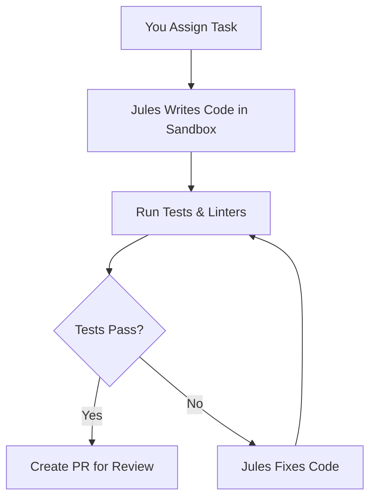
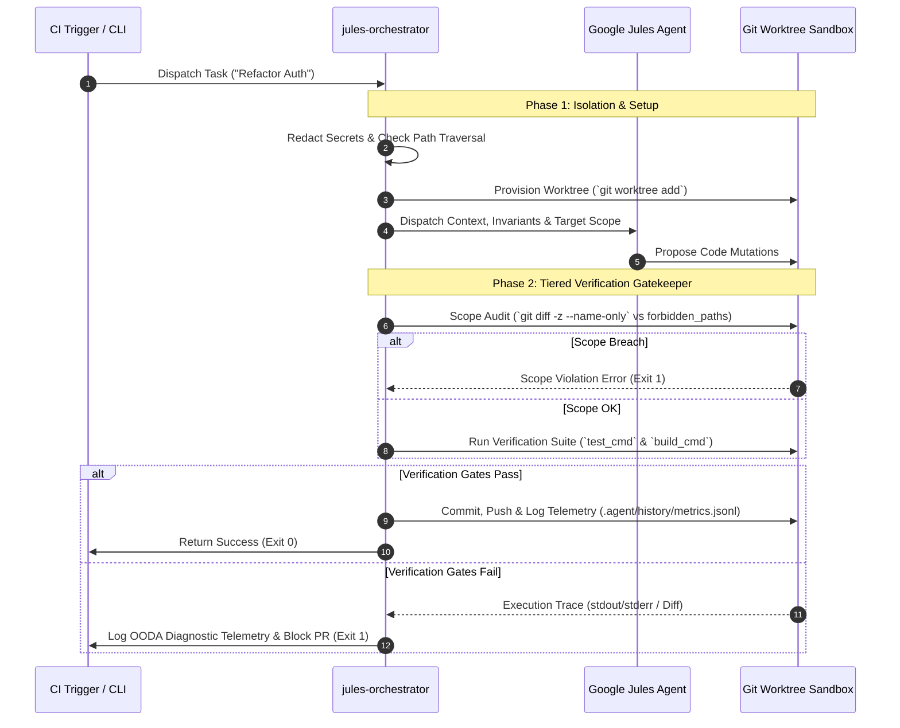

# Google Jules Orchestration Kit 🤖⚡

[](#)
[](https://www.npmjs.com/package/jules-orchestrator-kit)
[](https://opensource.org/licenses/MIT)
[](https://nodejs.org)
[](#)

**Turn Google Jules into an autonomous code builder that writes, tests, and fixes itself.**

> [!WARNING]
> **Alpha Release:** This kit is in active development. Please exercise caution before integrating it into critical production pipelines.
> 
> **API Budget Warning:** Autonomous loops (like OODA self-healing or large swarms) can consume significant Google Jules API quotas. We strongly recommend setting hard billing limits or starting with `JULES_DRY_RUN=1` to understand the workflow before scaling up!

> **💡 TL;DR**: Run `npx jules-orchestrator-kit` in your repo, assign tasks, and get working, tested Pull Requests—no manual review needed.

---

## 🎯 Is This For You?

| **Your Role**              | **What This Solves**                               | **Your Benefit**                                                          |
| -------------------------- | -------------------------------------------------- | ------------------------------------------------------------------------- |
| **Busy Developer**         | AI writes broken code or skips tests               | Automatic safety net catches errors before you review                     |
| **Team Lead**              | Need consistent quality from AI changes            | Enforces tests, linting, and scope boundaries automatically               |
| **DevOps Engineer**        | Want to scale AI across many repos                 | Parallel task swarms with security guardrails                             |
| **Open Source Maintainer** | Limited time to review AI contributions            | Self-correcting PRs that pass your CI                                     |
| **Power User**             | Need deterministic, production-grade orchestration | Git Worktrees, entropy-based secret redaction, MCP directives, OODA loops |

---

## 🚀 Get Started in 2 Minutes

### 1. Initialize (Auto-detects your tech stack)
Navigate to your project root and run:
```bash
npx jules-orchestrator-kit
```

### 2. Scaffold a Task
Generate a clean boilerplate markdown file so you don't have to start from scratch:
```bash
npm run jules:create "Refactor Auth"
```

### 3. Queue and Track
Edit the generated markdown file in `.agent/jules-queue/` and dispatch it:
```bash
npm run jules:queue
```

You can view the real-time status of your dispatched tasks using:
```bash
npm run jules:status
```

**What just happened?**
- Jules wrote code to fulfill your task.
- The orchestrator ran your tests automatically.
- If tests failed, Jules fixed the code and re-ran tests.
- You'll receive a Pull Request with working, verified code.

> 🔐 **New in v0.3.0 (The Epistemic Bridge)**: The init script generates a cryptographic Handshake Token (`.agent/JULES_WEB_SETUP.md`). Paste this into the Jules Web UI to sync your environment perfectly.

---

## 🤖 How It Works

### Simple Version (For Everyone)



1. **You define the task** - "Fix the memory leak in the cache module"
2. **Jules proposes changes** - In an isolated Git worktree sandbox
3. **Automatic verification** - Runs your test suite, linters, and type checks
4. **Self-correction** - If anything fails, Jules automatically retries with fixes
5. **Safe delivery** - Only working, tested code reaches your main branch

<details>
<summary><b>🔍 View Full System Architecture & Tiered Verification Gate (For Power Users)</b></summary>

The Orchestrator enforces a **strict 5-phase verification pipeline**:

1. **Queue & Redaction**: Dispatch via CLI/API/markdown files. Shannon Entropy detector (entropy > 3.6, length ≥ 20) strips secrets. Path traversal (`../`) is blocked.
2. **Isolation**: Provisions Git worktree sandbox for each task
3. **Scope Audit**: Validates changes against `forbidden_paths` from base branch (never PR branch)
4. **Tiered Verification**: Fast-fail linters → type checks → full test suite → build verification
5. **OODA Feedback Loop**: Parses stderr traces, logs telemetry to `.agent/history/metrics.jsonl`, blocks merge on exit code ≠ 0


</details>

---

## ⚙️ Configuration

### Custom Configuration (`.agent/jules.yml`)

The orchestrator automatically detects your tech stack, but you can edit `.agent/jules.yml` for fine-grained control:

```yaml
# Google Jules Repository Configuration (Version 2)
version: 2
test_cmd: "npm test"
build_cmd: "npm run build"
forbidden_paths:
  - ".github/**"
  - "**/secrets/**"
  - "**/*.pem"
  - "**/lock-manager/**"
  - "scripts/jules-*"
  - ".agent/jules.yml"
allow_paths: []
```

> 🛡️ **Zero-Trust Security Model**: Configuration is always read from your target base branch (`origin/main`), never from untrusted PR branches. This means even if an AI agent tries to modify its own security rules, the orchestrator enforces the immutable rules from main.

---

## 💡 Features

### 🛡️ Core Safety (For Everyone)

| Feature               | What It Does                                 | Example                               |
| --------------------- | -------------------------------------------- | ------------------------------------- |
| **Automatic Testing** | Runs your test suite against every AI change | `test_cmd: "npm test"`                |
| **Self-Fixing**       | Jules automatically corrects failed tests    | Retries up to 4 times before blocking |
| **Secret Protection** | Hides API keys, passwords, tokens            | Entropy > 3.6, length ≥ 20         |
| **Path Restrictions** | Blocks changes to sensitive files            | `.env`, `*.pem`, `.github/**`         |
| **Scope Boundaries**  | Prevents changes outside task scope          | `scope: ["src/auth/**"]`              |


### 🚀 Advanced Orchestration (For Power Users)

| Feature                 | Use Case                                  | Command                                                            |
| ----------------------- | ----------------------------------------- | ------------------------------------------------------------------ |
| **Git Worktree Swarms** | Run parallel tasks with isolation         | `JULES_USE_WORKTREES=true node scripts/jules-swarm.mjs tasks.json` |
| **Monorepo Support**    | Auto-detects Turbo, Nx, pnpm, Cargo       | Runs affected package tests only                                   |
| **Nightly Maintenance** | Scheduled audits & cleanup            | `node scripts/jules-nightly.mjs`                                   |
| **Queue Processing**    | Batch process tasks from markdown files   | `npm run jules:queue`                              |
| **Pre-Flight Sandbox**  | Test setup locally before cloud execution | `node scripts/jules-self-audit.mjs --preflight`                    |
| **OODA Feedback**       | Self-healing from test failures           | Logs to `.agent/history/metrics.jsonl`                             |

---

## 🔌 Expand with MCP (Model Context Protocol)

All task dispatches dynamically inject `<MCP_DIRECTIVE>` envelopes into task prompts. This forces Jules to adhere to strict read-before-write invariants and deterministic execution when operating alongside **MCP server tools**.

**Pro-tip:** You can supercharge Jules with external MCP servers! By connecting standard MCP servers to your environment, you give Jules direct access to your infrastructure and real-time documentation. Some powerful examples include:

* **SaaS APIs & Tooling:** Context 7, Linear, and v0 for issue tracking and UI generation.
* **Databases & Cloud:** Render, Neon, Supabase, Stitch, and Tinybird.
* **Framework Documentation:** Astro Docs, Cloudflare Docs, Next.js Docs, etc.

By feeding these MCPs into your ecosystem, Jules can automatically read the latest framework documentation or query your live database schema before writing code!

---

## 🌐 Integration Interfaces

The orchestrator supports two primary integration channels for manual tasks:

**1. Direct REST API Mode (`jules.googleapis.com`)**
When `JULES_API_KEY` and `JULES_REPO` are present in your environment, payloads are dispatched directly to the official Google Jules REST API endpoint. Handles HTTP 429 rate limits gracefully.

**2. Native Jules CLI Fallback**
If no API key is configured, the kit seamlessly falls back to invoking your local `jules` CLI binary via standard streams.

---

## ⚠️ Known Limitations & Workarounds

While this kit automates the heavy lifting of code generation and PR creation, there are a few limitations in how it interacts with the underlying Jules platform:

### Code Suggestions (Web UI Only)
Currently, there is no way to automatically extract "Suggestions" (the inline code review comments Jules sometimes proposes instead of direct commits) via the CLI or API. Suggestions can only be read directly inside the **Jules Web UI**.

* **Workaround for Local LLM Users:** If you are tinkering with Jules alongside a local LLM (e.g., Claude, Cursor, Antigravity) and Jules leaves a Suggestion, the easiest workflow is to open the Jules Web UI, copy the suggestion block, and paste it back into your local LLM to let it review and integrate the proposed changes.

---

## 📦 Supported Tech Stacks

<details>
<summary><b>🛠️ View Supported Language Manifests & Workspace Graphs</b></summary>

| Stack / Ecosystem           | Manifest / Workspace File             | Test Command                                   | Build Command                                   |
| --------------------------- | ------------------------------------- | ---------------------------------------------- | ----------------------------------------------- |
| **Turborepo**               | `turbo.json`                          | `npx turbo run test --filter=<pkg>...`         | `npx turbo run build --filter=<pkg>...`         |
| **pnpm Workspace**          | `pnpm-workspace.yaml`                 | `pnpm --filter=...<pkg> test`                  | `pnpm --filter=...<pkg> build`                  |
| **Nx Workspace**            | `nx.json`                             | `npx nx run-many -t test -p <pkg> --with-deps` | `npx nx run-many -t build -p <pkg> --with-deps` |
| **Bun**                     | `bunfig.toml` / `bun.lockb`           | `bun test`                                     | `bun run build`                                 |
| **Deno**                    | `deno.json` / `deno.jsonc`            | `deno test`                                    | `deno task build`                               |
| **JavaScript / TypeScript** | `package.json`                        | `npm run lint && npm test`                     | `npm run build`                                 |
| **Rust**                    | `Cargo.toml`                          | `cargo test --workspace`                       | `cargo build`                                   |
| **Go**                      | `go.mod`                              | `go test ./...`                                | `go build ./...`                                |
| **Python**                  | `pyproject.toml` / `requirements.txt` | `pytest`                                       | *(none)*                                        |
| **Elixir**                  | `mix.exs`                             | `mix test`                                     | `mix compile`                                   |
| **Ruby**                    | `Gemfile`                             | `bundle exec rake test`                        | *(none)*                                        |
| **Swift**                   | `Package.swift`                       | `swift test`                                   | `swift build`                                   |
| **Java (Maven/Gradle)**     | `pom.xml` / `build.gradle`            | `mvn test` / `./gradlew test`                  | `mvn compile` / `./gradlew assemble`            |
| **C / C++**                 | `Makefile`                            | `make test`                                    | `make build`                                    |

</details>

---

## 🤝 Contributing

We welcome contributions! Please follow these core principles:

1. **Zero External Dependencies**: Use ONLY native Node.js built-in modules (`node:fs`, `node:path`, `node:child_process`, `node:crypto`, `node:util`)
2. **Verification Suite**: Ensure 100% of unit tests pass cleanly (`npm test`)
3. **Conventional Commits**: Use standardized prefixes (`feat:`, `fix:`, `docs:`, `test:`, `chore:`)
4. **Cross-Platform Compatibility**: Normalize Windows backslashes (`\`) to POSIX slashes (`/`) for glob patterns and paths

---

## 📜 License

MIT License - feel free to use, modify, and share!

*Disclaimer: This is an independent open-source orchestration tool and is not officially affiliated with or endorsed by Google.*
