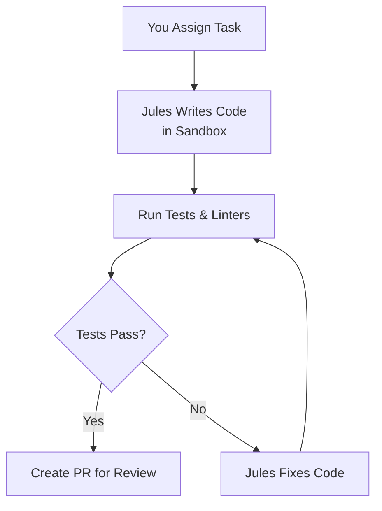
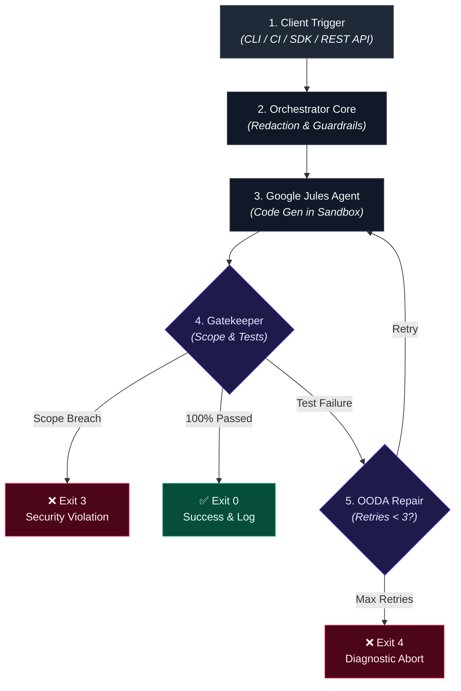
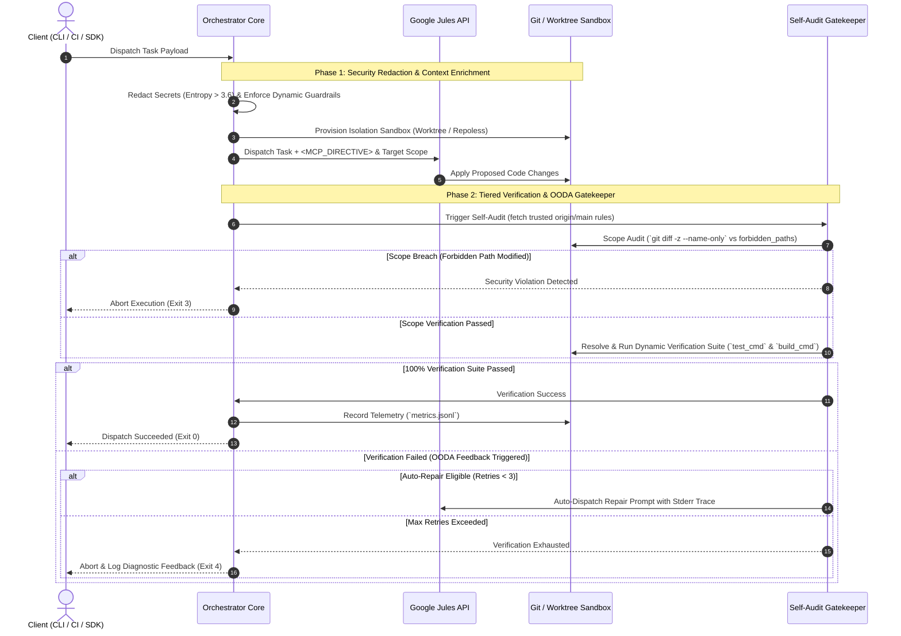

# Google Jules Orchestration Kit 🤖⚡

[](#)
[](https://www.npmjs.com/package/jules-orchestrator-kit)
[](https://opensource.org/licenses/MIT)
[](https://nodejs.org)
[](#)

**Turn Google Jules into an autonomous code builder that writes, tests, and fixes itself.**

> [!WARNING]
> **Alpha Release:** This kit is in active development. Please exercise caution before integrating it into critical production pipelines.
> 
> **Task Limit Warning:** Autonomous loops (like OODA self-healing or large swarms) can quickly consume your daily Google Jules task limits (e.g., 100 tasks/day on Pro, 300 tasks/day on Ultra). We strongly recommend starting with `JULES_DRY_RUN=1` to understand the workflow before scaling up!

> **💡 TL;DR**: Run `npx jules-orchestrator-kit` in your repo, assign tasks, and get working, tested Pull Requests—no manual review needed.

---

## 🎯 Is This For You?

| **Your Role**              | **What This Solves**                               | **Your Benefit**                                                          |
| -------------------------- | -------------------------------------------------- | ------------------------------------------------------------------------- |
| **Busy Developer**         | AI writes broken code or skips tests               | Automatic safety net catches errors before you review                     |
| **Team Lead**              | Need consistent quality from AI changes            | Enforces tests, linting, and scope boundaries automatically               |
| **DevOps Engineer**        | Want to scale AI across many repos                 | Parallel task swarms with security guardrails                             |
| **Open Source Maintainer** | Limited time to review AI contributions            | Self-correcting PRs that pass your CI                                     |
| **Power User**             | Need deterministic, production-grade orchestration | Git Worktrees, entropy-based secret redaction, MCP directives, OODA loops |

---

## 🚀 Get Started in 2 Minutes

### 1. Initialize (Auto-detects your tech stack)
Navigate to your project root and run:
```bash
npx jules-orchestrator-kit
```

### 2. Scaffold a Task
Generate a clean boilerplate markdown file so you don't have to start from scratch:
```bash
npm run jules:create "Refactor Auth"
```

### 3. Queue and Track
Edit the generated markdown file in `.agent/jules-queue/` and dispatch it:
```bash
npm run jules:queue
```

You can view the real-time status of your dispatched tasks using:
```bash
npm run jules:status
```

**What just happened?**
- Jules wrote code to fulfill your task.
- The orchestrator ran your tests automatically.
- If tests failed, Jules fixed the code and re-ran tests.
- You'll receive a Pull Request with working, verified code.

> 🔐 **New in v0.5.0 (The Epistemic Bridge)**: The init script generates a cryptographic Handshake Token (`.agent/JULES_WEB_SETUP.md`). Paste this into the Jules Web UI to sync your environment perfectly.

---

## 🤖 How It Works

### Simple Version (For Everyone)



1. **You define the task** - "Fix the memory leak in the cache module"
2. **Jules proposes changes** - In an isolated Git worktree sandbox
3. **Automatic verification** - Runs your test suite, linters, and type checks
4. **Self-correction** - If anything fails, Jules automatically retries with fixes
5. **Safe delivery** - Only working, tested code reaches your main branch

## 🏗️ Architecture & Pipeline Flow



> 💡 **Core Architectural Invariants**:
> - **Zero-Trust Base-Branch Security**: Security rules (`forbidden_paths`) are fetched exclusively from `origin/main` (never untrusted PR branches).
> - **Dynamic Command Resolution (`command-resolver.mjs`)**: Auto-detects workspace boundaries (Turborepo, pnpm, Nx, Cargo, pytest, npm).

<details>
<summary><b>🔍 View Detailed Sequence Diagram (Step-by-Step Execution Protocol)</b></summary>


</details>

---

## ⚙️ Configuration

### Custom Configuration (`.agent/jules.yml`)

The orchestrator automatically detects your tech stack, but you can edit `.agent/jules.yml` for fine-grained control:

```yaml
# Google Jules Repository Configuration (Version 2)
version: 2
test_cmd: "npm test"
build_cmd: "npm run build"
forbidden_paths:
  - ".github/**"
  - "**/secrets/**"
  - "**/*.pem"
  - "**/lock-manager/**"
  - "scripts/jules-*"
  - ".agent/jules.yml"
allow_paths: []
```

> 🛡️ **Zero-Trust Security Model**: Configuration is always read from your target base branch (`origin/main`), never from untrusted PR branches.

---

## 💡 Features

### 🛡️ Core Safety (For Everyone)

| Feature               | What It Does                                 | Example                               |
| --------------------- | -------------------------------------------- | ------------------------------------- |
| **Automatic Testing** | Runs test suite against every AI change      | `test_cmd: "npm test"`                |
| **Self-Fixing**       | Jules automatically corrects failed tests    | Retries up to 3 times before blocking |
| **Secret Protection** | Hides API keys, passwords, tokens            | Shannon Entropy > 3.6, length ≥ 20    |
| **Path Restrictions** | Blocks changes to sensitive files            | `.env`, `*.pem`, `.github/**`         |
| **Scope Boundaries**  | Prevents changes outside task scope          | `scope: ["src/auth/**"]`              |
| **Agent Scope Guard** | CI-enforced protected paths manifestation    | `.agent/protected-paths.json`         |
| **Payload Governor**  | Hard cap to prevent > 80 KB payload failures | Diffs capped at 75 KB                 |


| Feature                 | Use Case                                  | Command                                    |
| ----------------------- | ----------------------------------------- | ------------------------------------------ |
| **Git Worktree Swarms** | Parallel tasks with slot isolation        | `node scripts/jules-swarm.mjs tasks.json`  |
| **Suggested Scanner**   | Scan TODO/FIXME comments into task queues | `npm run jules:scan`                       |
| **Session Cleanup**     | Audit & close merged/stale REST sessions  | `npm run jules:cleanup -- --close-merged`  |
| **Repoless Sessions**   | Serverless ad-hoc analysis without repos  | `npm run jules:dispatch -- --repoless ...` |
| **Monorepo Support**    | Auto-detects Turbo, Nx, pnpm, Cargo       | Runs affected package tests only           |
| **Queue Pacing**        | Rate-limit queue launches (`--pace-ms`)   | `npm run jules:queue -- --pace-ms 500`     |
| **Pre-Flight Sandbox**  | Test setup locally before cloud execution | `node scripts/jules-self-audit.mjs --preflight`                    |
| **Security Fencing**    | Prompt injection defense & secret masking | Automatic `<UNTRUSTED_TASK_CONTEXT>` encapsulation                 |
| **OODA Feedback**       | Self-healing from test failures           | Logs to `.agent/history/metrics.jsonl`                             |
| **Mutex Lock Protocol** | Prevent concurrent file collisions        | `node scripts/lock-manager.mjs acquire`                            |
| **Baton Pass Protocol** | Stateful handovers to human/other AI      | `.agent/history/*-handover-*.md`                                   |

---

## 🔌 Expand with MCP (Model Context Protocol)

All task dispatches dynamically inject `<MCP_DIRECTIVE>` envelopes into task prompts. This forces Jules to adhere to strict read-before-write invariants and deterministic execution when operating alongside **MCP server tools**.

**Pro-tip:** You can supercharge Jules with external MCP servers! By connecting standard MCP servers to your environment, you give Jules direct access to your infrastructure and real-time documentation. Some powerful examples include:

* **SaaS APIs & Tooling:** Context 7, Linear, and v0 for issue tracking and UI generation.
* **Databases & Cloud:** Render, Neon, Supabase, Stitch, and Tinybird.
* **Framework Documentation:** Astro Docs, Cloudflare Docs, Next.js Docs, etc.

By feeding these MCPs into your ecosystem, Jules can automatically read the latest framework documentation or query your live database schema before writing code!

---

## 🌐 Integration Interfaces

The orchestrator supports two primary integration channels for manual tasks:

**1. Direct REST API Mode (`jules.googleapis.com`)**
When `JULES_API_KEY` and `JULES_REPO` are present in your environment, payloads are dispatched directly to the official Google Jules REST API endpoint. Handles HTTP 429 rate limits gracefully.

**2. Native Jules CLI Fallback**
If no API key is configured, the kit seamlessly falls back to invoking your local `jules` CLI binary via standard streams.

**3. Programmatic Node.js SDK (`index.mjs`)**
Downstream Node.js tools, MCP servers, and LLM orchestrators can import kit functions directly:
```js
import { runSelfAudit, scanCodebaseForTodos, resolveProjectCommands } from "jules-orchestrator-kit";

// Run pre-flight sandbox check
await runPreflightSandbox();

// Scan codebase for TODO/FIXME tasks
const tasks = scanCodebaseForTodos(process.cwd());
```

---

## ⚠️ Known Limitations & Workarounds

While this kit automates the heavy lifting of code generation and PR creation, there are a few limitations in how it interacts with the underlying Jules platform:

### Code Suggestions (Web UI Only)
Currently, there is no way to automatically extract "Suggestions" (the inline code review comments Jules sometimes proposes instead of direct commits) via the CLI or API. Suggestions can only be read directly inside the **Jules Web UI**.

* **Workaround for Local LLM Users:** If you are tinkering with Jules alongside a local LLM (e.g., Claude, Cursor, Antigravity) and Jules leaves a Suggestion, the easiest workflow is to open the Jules Web UI, copy the suggestion block, and paste it back into your local LLM to let it review and integrate the proposed changes.

---

## 📦 Supported Tech Stacks

<details>
<summary><b>🛠️ View Supported Language Manifests & Workspace Graphs</b></summary>

| Stack / Ecosystem           | Manifest / Workspace File             | Test Command                             | Build Command                            |
| --------------------------- | ------------------------------------- | ---------------------------------------- | ---------------------------------------- |
| **Turborepo**               | `turbo.json`                          | `npx turbo run test --filter=...`        | `npx turbo run build --filter=...`       |
| **pnpm Workspace**          | `pnpm-workspace.yaml`                 | `pnpm --filter=... test`                 | `pnpm --filter=... build`                |
| **Nx Workspace**            | `nx.json`                             | `npx nx run-many -t test -p ...`         | `npx nx run-many -t build -p ...`        |
| **Bun**                     | `bunfig.toml` / `bun.lockb`           | `bun test`                               | `bun run build`                          |
| **Deno**                    | `deno.json` / `deno.jsonc`            | `deno test`                              | `deno task build`                        |
| **JavaScript / TypeScript** | `package.json`                        | `npm test`                               | `npm run build`                          |
| **Rust**                    | `Cargo.toml`                          | `cargo test --workspace`                 | `cargo build`                            |
| **Go**                      | `go.mod`                              | `go test ./...`                          | `go build ./...`                         |
| **Python**                  | `pyproject.toml` / `requirements.txt` | `pytest`                                 | *(none)*                                 |
| **Elixir**                  | `mix.exs`                             | `mix test`                               | `mix compile`                            |
| **Ruby**                    | `Gemfile`                             | `bundle exec rake test`                  | *(none)*                                 |
| **Swift**                   | `Package.swift`                       | `swift test`                             | `swift build`                            |
| **Java (Maven/Gradle)**     | `pom.xml` / `build.gradle`            | `mvn test` / `./gradlew test`            | `mvn compile` / `./gradlew assemble`     |
| **C / C++**                 | `Makefile`                            | `make test`                              | `make build`                             |

</details>

---

## 🤝 Contributing

We welcome contributions! Please follow these core principles:

1. **Zero External Dependencies**: Use ONLY native Node.js built-in modules (`node:fs`, `node:path`, `node:child_process`, `node:crypto`, `node:util`)
2. **Verification Suite**: Ensure 100% of unit tests pass cleanly (`npm test`)
3. **Conventional Commits**: Use standardized prefixes (`feat:`, `fix:`, `docs:`, `test:`, `chore:`)
4. **Cross-Platform Compatibility**: Normalize Windows backslashes (`\`) to POSIX slashes (`/`) for glob patterns and paths

---

## 📜 License

MIT License - feel free to use, modify, and share!

*Disclaimer: This is an independent open-source orchestration tool and is not officially affiliated with or endorsed by Google.*
