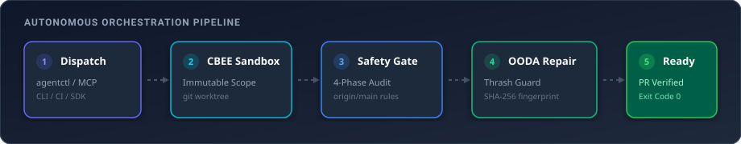
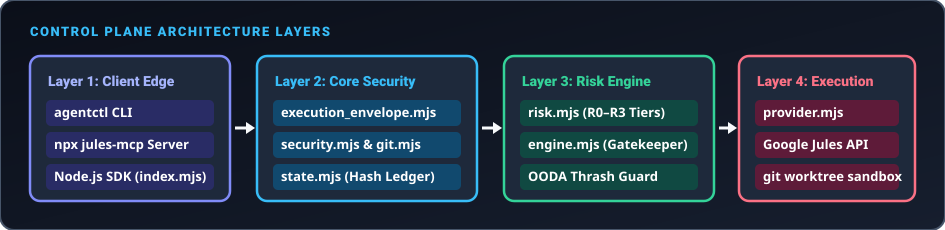
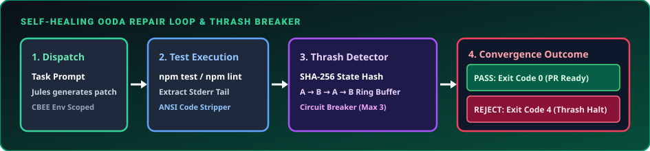
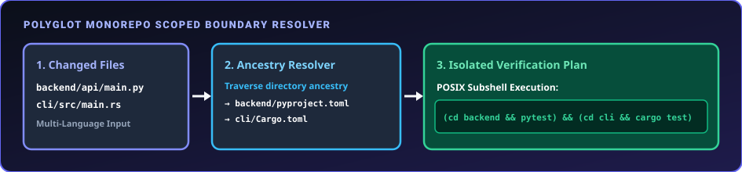
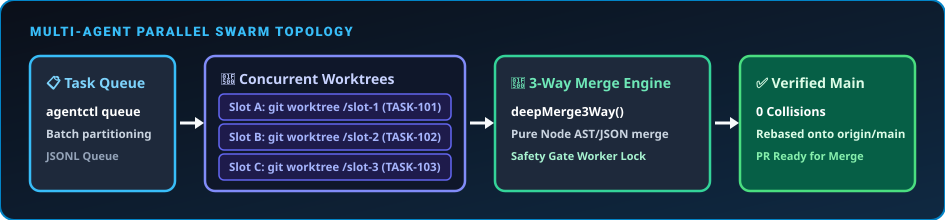

<div align="center">

# jules-orchestrator-kit

### Task orchestration and automated verification harness for Google Jules

<br/>

[](https://github.com/FullThrottle83/jules-orchestrator-kit/actions/workflows/jules-audit.yml)
[](https://www.npmjs.com/package/jules-orchestrator-kit)
[](https://opensource.org/licenses/MIT)
[](https://nodejs.org)
[](https://nodejs.org)
[](https://nodejs.org)

<br/>

<p align="center">
  <b>Zero-dependency safety gatekeeper, scoped sandboxing, and automated verification for coding agents.</b><br/>
  Runs deterministic test verification, secret scrubbing, and automated repair loops across any stack or monorepo before opening Pull Requests.
</p>

<br/>

<p align="center">
  <a href="#quickstart">Quickstart</a> &nbsp;•&nbsp;
  <a href="#overview">Overview</a> &nbsp;•&nbsp;
  <a href="#target-workflows">Target Workflows</a> &nbsp;•&nbsp;
  <a href="#triage-guidelines">Triage</a> &nbsp;•&nbsp;
  <a href="#cli-docs">CLI Docs</a> &nbsp;•&nbsp;
  <a href="#deep-dives">Deep Dives</a>
</p>

</div>

<br/>

<p align="center">
  
</p>

<br/>

---

<br/>

<a id="quickstart"></a>
## Quickstart

Get running in any repository in 3 commands (zero configuration required):

```bash
# 1. Scaffold config, AGENTS.md, role prompts and guardrails
#    (auto-detects Python, Rust, Go, Node, PHP, etc.)
npx jules-orchestrator-kit init
```

```bash
# 2. Commit what init wrote — .agent/config.yml is on the gate's deny list by
#    design, so leaving it uncommitted makes the first gate reject your tree
git add .agent AGENTS.md .gitignore && git commit -m "chore: add agent config"
```

```bash
# 3. Author a scoped, verified task envelope with guardrails & secret scrubbing
npx jules-orchestrator-kit task create
```

> [!TIP]
> **Not sure what to run next?**  
> `agentctl` with no arguments reads the repository state and prints the single
> next step — missing git repo, missing API key, empty queue, tasks ready to
> dispatch — instead of a wall of commands.

> [!TIP]
> **Prefer a global CLI?**  
> Install globally to access `agentctl` directly:
> ```bash
> npm install -g jules-orchestrator-kit
> agentctl init && agentctl task create && agentctl queue
> ```

<br/>

---

<br/>

<a id="overview"></a>
## Overview

> **`jules-orchestrator-kit` serves as a safety gate and automated test runner for AI coding agents.**  
> It drafts falsifiable task envelopes, executes verification commands in an isolated sandbox, automatically retries on test failures using captured diagnostics, and approves PRs only when 100% of tests pass cleanly.

<br/>

<a id="target-workflows"></a>
### Target Workflows

| Persona / Team | Primary Value | Everyday Commands |
| :--- | :--- | :--- |
| **Solo Developers** | Safely experiment with autonomous coding without risking broken branches, leaked API keys, or ruined git history. | `agentctl init`<br/>`agentctl task create` |
| **Repo Maintainers** | Automate bug fixes, dependency bumps, and PR reviews with self-healing test loops. | `agentctl gate`<br/>`agentctl queue` |
| **Monorepo Teams** | Isolate subproject verification (`backend/`, `frontend/`, `cli/`) so agent edits never thrash global test suites. | `agentctl swarm`<br/>`agentctl lock` |
| **Platform & Security** | Enforce fail-closed security policies, pre-commit secret scrubbing (including base64), and strict 75 KB diff limits. | `agentctl doctor`<br/>`agentctl dashboard` |

<br/>

---

<br/>

<a id="triage-guidelines"></a>
## Triage Guidelines: When to Dispatch Tasks

To maximize PR merge rates, dispatch tasks according to deterministic boundaries:

### Ideal Tasks (High Success Rate)
* **Scoped Bug Fixes & Code Changes:** Mechanically verifiable via unit tests (`pytest`, `npm test`, `cargo test`, `dotnet test`, `go test`).
* **Type & Linter Migrations:** Strict mode conversions, type annotations, and dead code elimination.
* **Dependency Bumps & CVE Patches:** Upgrading vulnerable lockfile dependencies with hermetic test validation.
* **Backend Refactoring:** Modularizing route controllers, API handlers, or database schemas.
* **Headless E2E / Playwright Tests:** UI changes verified by automated visual snapshots (`npx playwright test`).

### Out of Scope (Keep Human-in-the-Loop)
* **Unverifiable Visual UI Tweaks:** CSS/Tailwind adjustments without automated Playwright regression tests.
* **Closed Proprietary Platforms Without CLI:** Systems lacking local CLI or git integration (e.g. Salesforce GUI, Webflow).
* **Unmocked Live Cloud Systems:** Code requiring live connections to external cloud APIs without local mocks or emulators.
* **Protected Infrastructure Files:** Direct edits to `.github/workflows/`, deployment keys, or agent security gate rules (blocked fail-closed by `Agent Scope Guard`).

<br/>

---

<br/>

## Core Capabilities

* **Zero Runtime Dependencies:** Built exclusively on Node.js 20+ built-in modules (`node:fs`, `node:child_process`, `node:crypto`, `node:path`, `node:http`, `node:tty`, `node:test`).
* **Cross-Platform Parity:** Verified 100% green across Linux, macOS (Darwin), and Windows on Node 20, 22, and 24.
* **Autonomous Self-Healing Loop:** Captures test stderr/stdout, fingerprints error traces, and feeds structured context back into automated repair turns (up to 3 attempts) before human escalation.
* **Fail-Closed Security & Secret Redaction:** Evaluates explicit Deny rules before Allow rules against canonicalized, case-folded paths. Redacts high-entropy keys and base64-encoded credentials (such as Kubernetes `Secret` manifests).
* **Complexity & Cost Router:** Zero-dependency heuristic classifier (`src/router.mjs`) routing mechanical tasks to lightweight models while reserving primary models for complex refactors, with a `node --check` syntax-verification gate that transparently escalates a FAST-tier result to the primary provider if it left broken JS on disk.
* **Terminal UI & Diagnostic Matrix (`agentctl doctor`):** Interactive terminal dashboard, task sidecar manager, and automated transactional self-repair.
* **Verified Test Suite:** Tested with **688 unit tests across 85 suites passing in < 10.0s**.

<br/>

---

<br/>

<a id="cli-docs"></a>
## CLI Command Reference (`agentctl`)

`agentctl` is the unified command-line interface for `jules-orchestrator-kit`, available via `npx jules-orchestrator-kit <command>` or `agentctl <command>`.

| Command | Usage | Description | Exit Codes |
| :--- | :--- | :--- | :--- |
| `init` | `agentctl init [--interactive] [--tier pro] [--force]` | Interactive onboarding wizard & stack detector. Generates `.agent/config.yml` and scaffolds `AGENTS.md`, the role prompts, the guardrails and the runtime `.gitignore` entries. Existing files are preserved unless `--force`. | `0` (Created) |
| `budget` | `agentctl budget [--by-user] [--json] [reset]` | Reports rolling 24h task budget, quota headroom, and per-developer task attribution without external auth servers. | `0` (Status), `2` (Arg Error) |
| `task create` | `agentctl task create [--title <t>] [--prompt <p>] [--template <id>] [--role <name>] [--tier fast\|complex]` | Interactively authors & scopes falsifiable task envelopes with secret scrubbing, preflight gate checks, and DAG dependency wiring. | `0` (Queued), `1` (Secret/Unfalsifiable) |
| `task template` | `agentctl task template [<id>] [--list] [--json]` | Lists and synthesizes pre-calibrated task envelopes (Web, Deep Think & Agent Hardening: `web-cwv`, `web-wcag`, `web-seo`, `web-playwright`, `agent-dead-code-audit`, `web-flaky-heal`, `web-i18n`, `web-ai-access`, `agent-qa-mutation`, `agent-ci-falsify`, `agent-service-isolate`, `agent-error-paths`, `agent-security-audit`, `deep-debug`, `deep-feature`, `deep-optimize`, `deep-harden`). | `0` (Listed/Synthesized) |
| `dispatch` | `agentctl dispatch [-p <prompt>] [-f <file>] [-r <role>] [-t <tier>] [--author <name>] [--check-premise] [--auto-pr] [--repoless] [--dry-run]` | Dispatches autonomous task to the active provider with pre-flight idempotency checks, payload limits, and role prompt resolution. | `0` (Dispatched), `1` (Error) |
| `plan approve` | `agentctl plan approve <sessionId> [--dry-run] [--json]` | Approves pending execution plan for an active Jules session (`:approvePlan`) with automatic 404/503 retry backoff. | `0` (Approved), `1` (Error) |
| `session get` | `agentctl session get <sessionId> [--dry-run] [--json]` | Retrieves live session lifecycle state from provider REST API with token rotation. | `0` (Fetched), `1` (Error) |
| `pr harvest` | `agentctl pr harvest [--tier r0,r1] [--limit <n>] [--auto] [--allow-no-checks] [--dry-run]` | Discovers open agent PRs, evaluates CI checks & risk tiers, and auto-squashes green low-risk changes autonomously. A PR reporting **no** CI checks is skipped unless `--allow-no-checks` is passed, and an unavailable changed-file list blocks rather than classifying as low risk. | `0` (Triaged/Merged), `1` (Error) |
| `doctor` | `agentctl doctor [--json]` | Diagnostic DAG check runner & automated transactional self-repair engine. | `0` (Healthy), `1` (Failures) |
| `queue` | `agentctl queue [--dag] [--concurrency <n>] [--dry-run] [--json]` | Consumes and executes task envelopes in `.agent/jules-queue/` with Kahn's DAG dependency resolution. Non-task files (manifests, `README.md`) are skipped, and `--dry-run` previews without moving anything. | `0` (Complete) |
| `swarm` | `agentctl swarm [--json]` | Runs parallel multi-agent swarm across worker slots with PID liveness detection. | `0` (Complete) |
| `gate` / `audit`| `agentctl gate --mode working-tree [--json] [--json-report <path>]` | Runs security, secret scanning, and tiered verification gates (with declarative assertion support) against working tree or branch. | `0` (Approved), `3` (Scope), `5` (Diff >75K), `6` (Secret) |
| `assert` | `agentctl assert [--dir <d>] [--file <f>] [--max-mb <n>] [--gzip] [--targets <g>] [--patterns <p>] [--json] [--json-report <p>]` | Runs declarative zero-dependency verification assertion primitives (`assert:dir-size`, `assert:file-size`, `assert:file-patterns`, `assert:exists`). | `0` (Passed), `1` (Assertion Failed) |
| `rollback` | `agentctl rollback [sessionId \| --latest]` | Restores exact commit, uncommitted files, and cleans orphan task worktrees from pre-flight checkpoints. | `0` (Restored), `1` (Error) |
| `resume` | `agentctl resume <sessionId> --response "<reply>"` | Streams engineer response back into active Google Jules warm session context window. | `0` (Resumed), `1` (Error) |
| `test-gen` | `agentctl test-gen --title <t> --spec <s> [--run]` | Scaffolds falsifiable unit tests, verifies RED failure state, and locks test in `scope.deny`. | `0` (Scaffolded/Red) |
| `dashboard` | `agentctl dashboard [port]` | Starts zero-dependency local HTTP telemetry and audit visualizer dashboard. | `0` (Running) |
| `evidence` | `agentctl evidence <generate\|verify\|show>` | Generates, verifies, or prints SHA-256 cryptographic evidence manifests with test-tamper locking. | `0` (Verified), `1` (Tamper) |
| `flaky` | `agentctl flaky <status\|heal\|reset>` | Manages Wilson-quarantined tests (Exit Code 8) and dispatches automated anti-flakiness healing swarms. | `0` (Healed/Listed) |
| `mcp` | `agentctl mcp` | Starts stdio Model Context Protocol (MCP) server for Claude, Cursor, and Antigravity. | `0` / Stdio stream |
| `mcp init` | `agentctl mcp init [--target cursor\|vscode\|claude\|all]` | 1-click config scaffolding for Cursor (`.cursor/mcp.json`), VS Code tasks (`tasks.json`), and Claude Desktop. | `0` (Scaffolded) |

<br/>

---

<br/>

<a id="deep-dives"></a>
## Deep Dives & Technical Reference

<details>
<summary><b>Configuration Reference (<code>.agent/config.yml</code>)</b></summary>

<br/>

`jules-orchestrator-kit` auto-detects stack defaults, but allows explicit overrides through `.agent/config.yml`:

```yaml
# .agent/config.yml — Universal Orchestrator Configuration

version: 1
provider: "jules"        # Provider key ("jules" | "claude-code" | "codex" | "gemini-flash")
baseBranch: "main"       # Default target base branch
branchPrefix: "agent/"   # Prefix for task branches

# Verification commands (auto-detected by Stack Detector if omitted)
verify:
  test: "npm test"
  build: "npm run build"

# Scope protection rules (Deny-first evaluation)
scope:
  deny:
    - ".github/**"
    - ".agent/config.yml"
    - "keys/**"

# Plan tier. Defaults to `free` when unset — the kit will not assume you are
# paying for a larger plan than you are. Set this to unlock your real limits.
tier: "free"             # free | pro | ultra

# Risk model for auto-merge triage. Builtin patterns cover what is dangerous in
# any repository (CI, lockfiles, migrations, key material, IaC, auth). Add the
# paths that are sensitive to YOUR domain — these EXTEND the builtins.
risk:
  restricted:            # R3 — never auto-merged
    - "**/pricing/**"
    - "**/billing/**"
  consequential:         # R2 — always requires a human read
    - "packages/api/**"
  max_routine_diff_lines: 400

# Operational limits & governors (tier defaults shown; any key here overrides)
limits:
  diffKb: 75             # Diff Payload Governor limit
  promptKb: 50           # Maximum prompt payload size
  dailyTasks: 300        # Task quota per rolling 24h window (not per calendar day)
  repairAttempts: 3      # Maximum repair iterations
  concurrency: 15        # Worker slots (defaults free: 3, pro: 8, ultra: 15)

# Dynamic Complexity & Cost Router — opt-in, disabled by default.
router:
  enabled: false
  fast: "gemini-flash"    # Trivial/mechanical tasks (score <= threshold)
  complex: "jules"        # Complex/multi-file/safety-sensitive tasks
  threshold: 0            # Heuristic score threshold for escalation
```

</details>

<br/>

<details>
<summary><b>26+ Supported Languages, Frameworks & Stacks</b></summary>

<br/>

```
Ecosystems Natively Detected & Verified by Stack Detector:
├── Python / Django (pyproject.toml, requirements.txt, setup.py, manage.py)
├── Systems / Rust Cargo (Cargo.toml)
├── Systems / Go (go.mod)
├── Systems / CMake & Make (CMakeLists.txt, Makefile)
├── JS / TS Workspaces (turbo.json, pnpm-workspace.yaml, nx.json)
├── JS / TS Runtimes (bunfig.toml, deno.json, package.json)
├── PHP / Laravel / WordPress (composer.json, phpunit.xml, pest.php, artisan, wp-cli.yml)
├── .NET / C# / F# (*.sln, *.csproj, *.fsproj, global.json)
├── Mobile / Dart / Flutter (pubspec.yaml)
├── Mobile / Swift / Xcode (Package.swift)
├── Mobile / React Native (app.json, react-native.config.js)
├── Web3 / Solidity Foundry (foundry.toml, remappings.txt) — offline-enforced
├── Web3 / Solidity Hardhat (hardhat.config.js, hardhat.config.ts)
├── Elixir / Phoenix (mix.exs)
├── Ruby / Rails (Gemfile)
├── Java / Maven & Gradle (pom.xml, build.gradle, build.gradle.kts)
└── Devcontainers & Docker Compose (.devcontainer/devcontainer.json, docker-compose.yml, Dockerfile)
```

</details>

<br/>

<details>
<summary><b>System Architecture & Verification Diagrams</b></summary>

<br/>

### 1. Control Plane Architecture Layers
<p align="center">
  
</p>

### 2. Autonomous Verification & Repair Loop
<p align="center">
  
</p>

### 3. Polyglot Monorepo Scoped Boundary Resolver
<p align="center">
  
</p>

### 4. Multi-Agent Parallel Swarm Topology
<p align="center">
  
</p>

</details>

<br/>

<details>
<summary><b>Multi-Provider Failover & Cost Router SDK</b></summary>

<br/>

### Multi-Provider Failover SDK (`createFailoverProvider`)
```javascript
import { createFailoverProvider, loadConfig } from "jules-orchestrator-kit";

const config = loadConfig(process.cwd());
const provider = createFailoverProvider(["jules", "claude-code"], config);

const result = await provider.dispatch(
  { title: "Repair failing tests", prompt: "Fix the failing test suite." },
  { root: process.cwd() }
);
```

### Cost Router SDK (`resolveRoutedProvider`)
```javascript
import { resolveRoutedProvider, loadConfig } from "jules-orchestrator-kit";

const config = loadConfig(process.cwd()); // router.enabled must be true in .agent/config.yml
const { provider, classification } = resolveRoutedProvider(
  { title: "Fix typo", prompt: "Fix a typo in the README." },
  config
);
console.log(classification.tier); // "fast" | "complex"
```

### Syntax-Verified FAST Tier (`createSyntaxVerifiedProvider`)
`resolveRoutedProvider()` already wraps the FAST tier with this; use it directly only when composing your own provider cascade.
```javascript
import { createProvider, createSyntaxVerifiedProvider, loadConfig } from "jules-orchestrator-kit";

const config = loadConfig(process.cwd());
const fast = createSyntaxVerifiedProvider(
  createProvider("gemini-flash", config),
  createProvider("jules", config),
  config
);

// If gemini-flash leaves broken .js/.mjs/.cjs on disk, this transparently
// re-dispatches through "jules" instead of returning the broken result.
const result = await fast.dispatch({ prompt: "Fix a typo." }, { root: process.cwd() });
```

</details>

<br/>

<details>
<summary><b>Feature Roadmap & Shipped Milestones</b></summary>

<br/>

| Feature | Module / Command | Architectural Description | Status |
| :--- | :--- | :--- | :---: |
| **Queue Runner Fidelity** | `src/dag-engine.mjs`, `src/engine.mjs` | Queue selection is by task shape rather than file extension, so manifests and READMEs are skipped instead of dispatched, and `--dry-run` leaves the queue untouched. | **v0.38.2** *(Shipped)* |
| **Release Gate Enforcement & Wizard Smoke Test** | `.github/workflows/jules-audit.yml`, `scripts/release.mjs`, `test/wizard-smoke.test.mjs` | Doc-sync gate runs in CI rather than by hand, releases block on a green CI matrix for `HEAD`, per-test deadlines turn a hang into a failure, and the real `init` wizard is driven end to end over a fake TTY. | **v0.38.1** *(Shipped)* |
| **Multi-OS CI Matrix & TUI Hardening** | `scripts/run-tests.mjs`, `src/state.mjs`, `src/git.mjs` | Automated 9-job CI matrix across Linux, macOS, and Windows on Node 20/22/24 with raw-mode TUI resilience and native Windows command quoting. | **v0.38.0** *(Shipped)* |
| **Base64 Secret Detection & Budget Fix** | `src/security.mjs`, `src/budget.mjs` | Secret scanner decodes base64 before matching structured patterns (K8s secrets), and `budget reset` preserves confirmed provider sessions. | **v0.37.0** *(Shipped)* |
| **Universal AI Crawler Policy & llms.txt** | `src/web-templates.mjs` (`web-ai-access`) | Cross-surface consistency for crawler directives (`robots.txt`, meta tags, `X-Robots-Tag`) and `llms.txt` local route integrity. | **v0.36.0** *(Shipped)* |
| **Silence Governor & Flaky Test Swarm** | `src/webhook.mjs`, `src/flaky-ledger.mjs` | Notification alert throttling with interruption budgeting, and automated anti-flakiness swarm coordinator. | **v0.35.0** *(Shipped)* |
| **Rolling 24h Quota & Plan Concurrency** | `src/state.mjs`, `src/config.mjs` | Rolling 24-hour quota accounting matching vendor reset windows and true concurrency limits (3/15/60). | **v0.34.0** *(Shipped)* |
| **Cost Router & Guided First Run** | `src/router.mjs`, `src/ops/next-step.mjs` | Heuristic task classifier routing trivial tasks to fast models, and guided single-command first run workflow. | **v0.33.0** *(Shipped)* |
| **DAG Task Queue & Specialist Roles** | `src/dag-engine.mjs`, `src/evidence.mjs` | Kahn's-algorithm dependency queue execution (`queue --dag`), specialist role prompts (`overseer`, `bolt`, `sentinel`, `janitor`), and SHA-256 evidence manifests. | **v0.32.5** *(Shipped)* |
| **Warm Session Resumption & PR Bundler** | `src/provider.mjs`, `src/engine.mjs` | Multi-turn warm session context streaming via `POST /v1alpha/sessions/{id}:sendMessage` & evidence PR descriptions. | **v0.31.0** *(Shipped)* |
| **TDD Harness & Prompt Falsifiability Linter** | `agentctl test-gen`, `agentctl task optimize` | Automated RED-state test generator, `scope.deny` test locking, and prompt testability linter with fuzzy path resolution. | **v0.31.0** *(Shipped)* |
| **Atomic Git Checkpoint & Rollback** | `agentctl rollback` (`src/ops/checkpoint.mjs`) | Pre-flight git HEAD/stash snapshotting, atomic rollback restoration, and 10-session pruning rotation. | **v0.31.0** *(Shipped)* |
| **Interactive UX Engine & TUI Engine** | `src/ux/` (`capabilities`, `key-decoder`, `renderer`, `layout`, `widgets`) | Zero-dependency terminal capabilities detector, sequence key decoder, virtual frame renderer, and widgets. | **v0.30.0** *(Shipped)* |
| **PR Review Auto-Remediation Loop** | `agentctl review-repair` (`src/review-repair.mjs`) | Ingests GitHub PR review comments (`CHANGES_REQUESTED`), extracts line/file context, and dispatches automated repair turns. | **v0.27.0** *(Shipped)* |

</details>

<br/>

---

<br/>

## 📖 Documentation & External References

- [**System Architecture & Pipeline Overview**](./docs/architecture.md) — Comprehensive technical sequence diagrams and control plane specifications.
- [**Google Jules Official Documentation**](https://jules.google) — Official platform overview and API specifications for Google Jules.
- [**Examples & Task Envelope Recipes**](./EXAMPLES.md) — Production YAML and Markdown task envelopes.
- [**Changelog**](./CHANGELOG.md) — Full release history and migration guides.

<br/>

---

<br/>

## ⚖️ Disclaimer

`jules-orchestrator-kit` is an independent, community-driven open-source project and is not affiliated with, endorsed by, or sponsored by Google, Google LLC, or Alphabet Inc. "Google", "Google Jules", and related marks are trademarks of Google LLC.

<br/>

---

<br/>

<div align="center">
  <p><b>jules-orchestrator-kit</b> • Built with zero external dependencies for Google Jules and autonomous agent workflows.</p>
</div>

