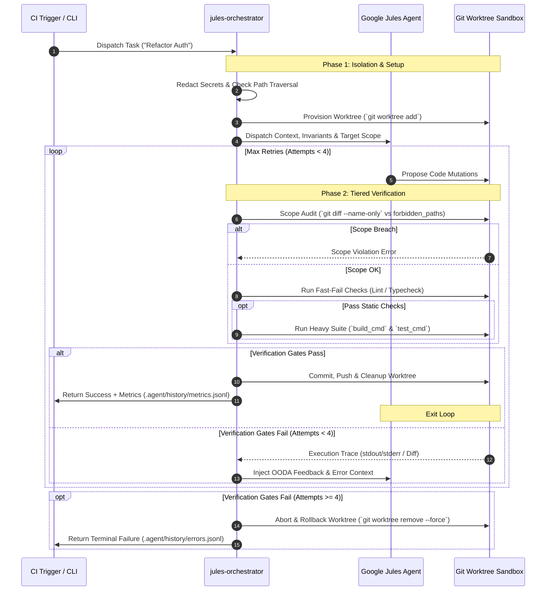

# Google Jules Orchestration Kit 🤖⚡

[](https://www.npmjs.com/package/jules-orchestrator-kit)
[](https://opensource.org/licenses/MIT)
[](https://nodejs.org)
[](#)

A lightweight, zero-dependency toolkit that upgrades **Google Jules** into a **fully autonomous, self-correcting background code builder** for any repository (Next.js, Vite, Node, Bun, Deno, Python, Go, Rust, Elixir, Ruby, Swift, Java, C/C++, Monorepos, etc.).

Whether you are a beginner looking to automate bug fixes without breaking your app, or a power user orchestrating parallel AI task swarms, this kit handles the heavy lifting of prompting, testing, security, and verification.

> **TL;DR**: Don't just chat with Google Jules—put it to work. Run `npx jules-orchestrator-kit` inside your project. Assign tasks, and the kit will automatically test the AI's code, tell it to fix any mistakes, and only present you with working, tested Pull Requests.

---

## 🎯 Who is this for?

**🌱 For Everyday Developers:**  
AI agents can write broken code or skip tests. This kit acts as an automated safety net: it detects your tech stack, runs your tests against the AI's code, catches errors, and prompts the AI to self-correct *before* you review the Pull Request.

**🔥 For Power Users & Senior Engineers:**  
Unlock deterministic, production-grade orchestration. Includes Git Worktree multi-task swarms, Shannon Entropy secret redaction, MCP (Model Context Protocol) directive envelopes, OODA self-healing feedback loops, and scope boundary locks.

---

## 🚀 Quick Start: Zero to Autonomous AI

### 1. Initialize your project
Run this command inside the root of **any target repository**. It automatically detects your tech stack and sets up safety guardrails:

```bash
npx jules-orchestrator-kit

# Or launch the interactive setup wizard:
npx jules-init --interactive
```

### 2. Dispatch your first task
Once initialized, you can immediately send tasks to Jules. The Orchestrator handles prompting, testing, security, and self-correction in the background:

```bash
node scripts/jules-dispatch.mjs "Refactor rate limiter" "Implement sliding window rate limiting in src/utils/rate-limit.ts"
```

*(**Pro-tip:** Add `JULES_DRY_RUN=1` before the command to test prompt generation locally without executing the remote API).*

---

## 🧠 How It Works: The Autonomous Loop

Instead of blindly trusting AI code mutations, the Orchestrator acts as a strict manager enforcing a **Tiered Verification Gate**:

1. **Queue a Task:** Dispatch via CLI, REST API, or drop markdown files into `.agent/jules-queue/`.
2. **Secret & Path Defense:** Hides passwords, API keys (`entropy > 3.6`), and blocks path traversal (`../`).
3. **Jules Proposes Code:** Google Jules mutates code in an isolated environment.
4. **Tiered Verification:** Enforces scope bounds (`git diff`), runs fast-fail linters/type-checks, then executes full test/build suites.
5. **Self-Correction (OODA Loop):** If tests fail, stderr traces are fed back to Jules to self-correct (up to 4 attempts).
6. **Clean Pull Request:** Once verified green, commits & pushes clean code to GitHub.

<details>
<summary><b>🔍 View System Architecture Diagram (For Power Users)</b></summary>



</details>

---

## 💡 Core Capabilities (8 Component Suite)

### 🛠️ The Basics

* **Auto-Configuration (`bin/init.js`)**: Instantly scaffolds your repo using `node:util.parseArgs` with an interactive TTY wizard (`-i`) or silent CI fallback.
* **Queue Runner (`scripts/jules-queue-runner.mjs`)**: Drop markdown task specifications into `.agent/jules-queue/` and let the runner process them sequentially.
* **Nightly Maintenance (`scripts/jules-nightly.mjs`)**: Schedules automated background audits (security leak scans, WCAG accessibility checks, dead code pruning).

### 🔒 Security & Guardrails

* **Secret & Traversal Redaction (`scripts/jules-dispatch.mjs`)**: Shannon Entropy detector strips API keys and secrets (`entropy > 3.6`, `length >= 20`) while preserving valid file paths. Supports dry-run testing (`JULES_DRY_RUN=1`).
* **Dynamic Guardrails (`.agent/rules/dynamic-guardrails.json`)**: RegEx-based rule matching that injects targeted stack guardrails into prompts on-the-fly.

### 🐝 Advanced Orchestration

* **Monorepo Boundary Resolver (`scripts/command-resolver.mjs`)**: Auto-detects `turbo`, `nx`, `pnpm`, or `Cargo` workspaces to run targeted affected package verifications (`git diff`) instead of full-repo test suites.
* **Self-Healing Gatekeeper (`scripts/jules-self-audit.mjs`)**: Unshallows git history in CI runners (`git fetch --unshallow`), enforces `forbidden_paths`, extracts OODA feedback error traces, and logs telemetry to `.agent/history/metrics.jsonl`.
* **Git Worktree Swarms (`scripts/jules-swarm.mjs`)**: Manages multi-task batches in isolated Git worktrees (`JULES_USE_WORKTREES=true`) with scope boundary isolation.

---

## ⚙️ Configuration & Zero-Trust Security

The orchestrator creates an `.agent/jules.yml` file to manage repo-level verification and security:

```yaml
# Google Jules Repository Configuration (Version 2)
version: 2
test_cmd: "npm test"
build_cmd: "npm run build"
forbidden_paths:
  - ".github/**"
  - "**/secrets/**"
  - "**/*.pem"
  - "**/lock-manager/**"
  - "scripts/jules-*"
  - ".agent/jules.yml"
allow_paths: []
```

> 🛡️ **Zero-Trust Security Model**: `allow_paths` and `forbidden_paths` rules are read **strictly from the target base branch** (`origin/main`), never from untrusted PR branches. Even if an AI agent hallucinates and tries to modify its own security rules in a PR branch, the Orchestrator enforces the immutable rules defined on `main`.
> ℹ️ Setting `build_cmd: ""` explicitly skips the build verification step (useful for pure test suites or scripts). Note that `.agent/jules.yml` uses a zero-dependency parser that supports flow (`[...]`) and block (`- item`) list subsets.

---

<details>
<summary><b>🛠️ Supported Language Manifests & Workspace Graphs (15+ Tech Stacks)</b></summary>

| Stack / Ecosystem | Manifest / Workspace File | Default Verification Command |
|---|---|---|
| **Turborepo** | `turbo.json` | `npx turbo run test --filter=<pkg>...` |
| **pnpm Workspace** | `pnpm-workspace.yaml` | `pnpm --filter=...<pkg> test` |
| **Nx Workspace** | `nx.json` | `npx nx run-many -t test -p <pkg> --with-deps` |
| **Bun** | `bunfig.toml` / `bun.lockb` | `bun test && bun run build` |
| **Deno** | `deno.json` / `deno.jsonc` | `deno test && deno task build` |
| **JavaScript / TypeScript** | `package.json` | `npm run lint && npm test` (or `npm run check:all`) |
| **Rust** | `Cargo.toml` | `cargo test -p <pkg>` / `cargo test --workspace` |
| **Go** | `go.mod` | `go test ./... && go build ./...` |
| **Python** | `pyproject.toml` / `requirements.txt` | `pytest` |
| **Elixir** | `mix.exs` | `mix test && mix compile` |
| **Ruby** | `Gemfile` | `bundle exec rake test` |
| **Swift** | `Package.swift` | `swift test && swift build` |
| **Java (Maven/Gradle)** | `pom.xml` / `build.gradle` | `mvn test` / `./gradlew test` |
| **C / C++** | `Makefile` | `make test && make build` |

</details>

---

<details>
<summary><b>📖 Advanced Workflows (Queues, Swarms, Nightly Maintenance)</b></summary>

### 1. Process an entire queue of background tasks

```bash
npm run jules:queue
```

### 2. Run Rate-Limited Swarms with Scope Isolation

Run massive parallel refactors safely. The orchestrator uses `tasks.json` file boundary `scope` segregation to prevent parallel task collisions:

```bash
JULES_SWARM_CONCURRENCY=5 JULES_USE_WORKTREES=true node scripts/jules-swarm.mjs tasks.json
```

*(Example `tasks.json` constraint: `[ { "id": "t1", "prompt": "Refactor auth", "scope": ["src/auth/**"] } ]`)*

### 3. Run Nightly Maintenance Suite

```bash
node scripts/jules-nightly.mjs --dry-run
```

### 4. Audit Jules PRs before merging in CI

```bash
node scripts/jules-self-audit.mjs
```

</details>

---

<details>
<summary><b>🌐 Integration Interfaces: CLI, REST API & MCP Directives</b></summary>

`jules-orchestrator-kit` supports three primary integration channels:

### 1. Direct REST API Mode (`jules.googleapis.com`)
When `JULES_API_KEY` and `JULES_REPO` are present in your environment (`.env` or CI secrets), payloads are dispatched directly to the official Google Jules REST API endpoint.
- Handles HTTP 429 rate limits gracefully.
- Automatically maps `startingBranch` and `sourceContext`.

### 2. Native Jules CLI Fallback (`jules new`)
If no API key is configured, the kit seamlessly falls back to invoking your local `jules` CLI binary. Prompts are piped directly via `stdin` to bypass OS `ARG_MAX` shell argument length limits.

### 3. MCP (Model Context Protocol) Directives
All task dispatches dynamically inject `<MCP_DIRECTIVE>` envelopes into task prompts:
```xml
<MCP_DIRECTIVE>
  <system_state>HEADLESS_CI_MODE</system_state>
  <strict_invariants>
    <rule>1. READ-BEFORE-WRITE: Inspect symbol definitions before editing.</rule>
    <rule>2. VERIFICATION LOOP: Execute test_cmd and pass with 0 errors.</rule>
    <rule>3. ABORT CONDITION: Terminate on 4+ repeated test failures.</rule>
    <rule>4. ASSERTION QUALITY: Unit tests created or modified MUST contain explicit assertions.</rule>
  </strict_invariants>
</MCP_DIRECTIVE>
```
This forces Jules to adhere to strict read-before-write invariants and deterministic execution when operating alongside MCP server tools.

</details>

---

<details>
<summary><b>🤝 Contributing & Code Guidelines</b></summary>

We welcome contributions! Please follow these core principles when submitting Pull Requests:

1. **Zero External Dependencies**: Keep the orchestrator engine 100% dependency-free. Use ONLY native Node.js built-in modules (`node:fs`, `node:path`, `node:child_process`, `node:crypto`, `node:util`).
2. **Verification Suite**: Ensure 100% of unit tests pass cleanly (`npm test`).
3. **Conventional Commits**: Use standardized commit message prefixes (`feat:`, `fix:`, `docs:`, `test:`, `chore:`).
4. **Cross-Platform Compatibility**: Always normalize Windows backslashes (`\`) to POSIX slashes (`/`) for glob patterns and paths.

</details>

---

## 📜 License & Disclaimer

MIT License - feel free to use, modify, and share!

*Disclaimer: This is an independent open-source orchestration tool and is not officially affiliated with or endorsed by Google.*
