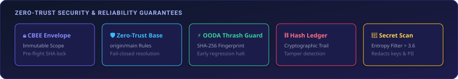
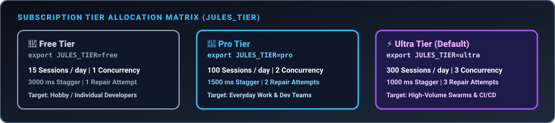
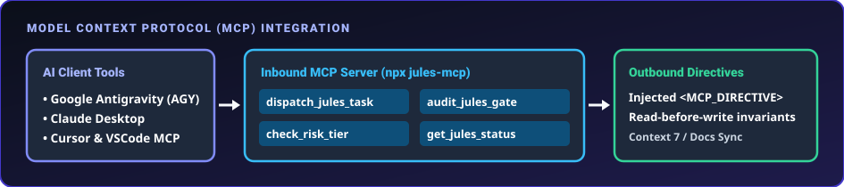

<div align="center">

# 🚀 jules-orchestrator-kit

### Universal Autonomous AI Agent Orchestration Kernel for Google Jules

<br/>

[](https://github.com/FullThrottle83/jules-orchestrator-kit/actions/workflows/jules-audit.yml)
[](https://www.npmjs.com/package/jules-orchestrator-kit)
[](https://opensource.org/licenses/MIT)
[](https://nodejs.org)
[](https://nodejs.org)

<br/>

<p align="center">
  <b>The zero-dependency safety gatekeeper and self-healing engineering kernel for autonomous coding agent swarms.</b>
  Transforms single-turn AI chat assistants into production-grade engineering swarms running 300+ daily sessions across any language or monorepo.
</p>

<br/>

<p align="center">
  <a href="#what-is-kit">💡&nbsp;What&nbsp;is&nbsp;Kit?</a> &nbsp;•&nbsp;
  <a href="#who-is-it-for">👥&nbsp;Who&nbsp;Is&nbsp;It&nbsp;For?</a> &nbsp;•&nbsp;
  <a href="#quickstart">⚡&nbsp;Quickstart</a> &nbsp;•&nbsp;
  <a href="#triage-guidelines">🎯&nbsp;Triage</a> &nbsp;•&nbsp;
  <a href="#matrix">📊&nbsp;Matrix</a>
  <br/>
  <a href="#configuration">⚙️&nbsp;Configuration</a> &nbsp;•&nbsp;
  <a href="#architecture">🏛️&nbsp;Architecture</a> &nbsp;•&nbsp;
  <a href="#cli-docs">🛠️&nbsp;CLI&nbsp;Docs</a> &nbsp;•&nbsp;
  <a href="#providers">🔌&nbsp;Providers</a> &nbsp;•&nbsp;
  <a href="#roadmap">🗺️&nbsp;Roadmap</a>
</p>

</div>

<br/>

<p align="center">
  
</p>

<br/>

---

<br/>

<a id="what-is-kit"></a>
## 💡 2-Sentence Mental Model

> [!TIP]
> **Think of `jules-orchestrator-kit` as an automated Engineering Manager for AI coding agents.**  
> It hands out clear tasks, runs your tests in an isolated sandbox, fixes broken code automatically, and only opens a Pull Request when 100% of your tests pass.

<br/>

---

<br/>

<a id="who-is-it-for"></a>
## 👥 Who Is It For?

Whether you are trying your first AI coding session or running enterprise monorepo swarms, `jules-orchestrator-kit` scales with your workflow:

<br/>

| Role | Primary Value Proposition | Key Commands |
| :--- | :--- | :--- |
| **🌱 Beginners & Solo Developers** | Safely experiment with AI agents without risking broken code, leaked API keys, or ruined git history. | `agentctl init`<br/>`agentctl task create` |
| **📦 Single-Repo Maintainers** | Automate bug fixes, dependency updates, and PR reviews with automated OODA test verification. | `agentctl gate`<br/>`agentctl queue` |
| **🏗️ Monorepo Engineering Teams** | Isolate subproject verification (`backend/`, `frontend/`, `cli/`) so agent edits never thrash global test suites. | `agentctl swarm`<br/>`agentctl lock` |
| **🛡️ Platform & Security Engineers** | Enforce zero-trust security policies, pre-commit secret scrubbing, and strict 75 KB diff payload limits. | `agentctl doctor`<br/>`agentctl dashboard` |

<br/>

---

<br/>

## 🎯 Why `jules-orchestrator-kit`?

Autonomous coding agents can write software at 100× human speed—but unconstrained agents introduce silent regressions, leak API keys, hallucinate test assertions, and thrash shared monorepos.

`jules-orchestrator-kit` provides the missing **Safety, Orchestration, and Verification Kernel** for high-reliability AI agent deployments:

* **🔥 Warm Multi-Turn Session Resumption (`v0.31.0`):** Streams OODA repair prompts directly into active Google Jules session streams via `POST /v1alpha/sessions/{id}:sendMessage`, saving 60–80% context tokens while preserving reasoning context.

* **🧪 Automated TDD Red-to-Green Harness (`agentctl test-gen`):** Scaffolds falsifiable unit tests from bug specs, verifies **RED** failure state, locks the test file in `scope.deny`, and tasks Jules with making it pass (**GREEN** state).

* **🛡️ 1-Click Atomic Git Checkpoint & Rollback (`agentctl rollback`):** Snapshots working tree state, git diffs, and stashes before every session, enabling instant 1-command git restoration.

* **🌐 Verification Sandbox & SSR Hydration Prober (`verify.server`):** Executes deterministic `setup`/`teardown` hooks for databases and boots dev servers to intercept React/Next.js SSR hydration panics before approving PRs.

* **⚡ AST Blast-Radius Selective Testing:** Traverses file import dependency graphs to execute only affected downstream test suites, cutting monorepo test latency from minutes to milliseconds.

* **🚨 Asynchronous HITL Escalation Bridge (`agentctl escalate`):** Dispatches Slack & Discord webhook alerts when Jules needs feedback, allowing engineers to unblock agents asynchronously via `agentctl resume <id> --response "<reply>"`.

* **🔒 Zero Runtime Dependencies:** Built exclusively on Node.js 20+ built-ins (`node:fs`, `node:child_process`, `node:crypto`, `node:path`, `node:http`, `node:tty`, `node:test`). Zero third-party npm packages mean zero supply-chain CVE risk.

* **🛡️ Fail-Closed Security Gatekeeper:** Unconditionally evaluates explicit Deny rules *before* Allow rules, redacts high-entropy secrets and PII from dry-runs and git diffs, and rejects PRs exceeding the 75 KB Diff Payload governor.

* **🔄 Autonomous OODA Self-Healing:** Captures test stderr/stdout, normalizes failure fingerprints, and feeds structured error contexts back into repair iterations (up to 3 automatic attempts) before human escalation.

* **💻 Native Interactive UX & Command Palette (`v0.30.0`):** Features a zero-dependency full-screen Terminal Engine (`capabilities`, `key-decoder`, `renderer`, `layout`, `widgets`), interactive diagnostic matrix (`agentctl doctor`), task queue/swarm managers (`agentctl queue`, `agentctl swarm`), and a searchable Command Palette.

* **🌐 Universal Polyglot Spine:** Natively auto-detects 24+ tech stacks (PHP/Laravel/WordPress, .NET/C#, Python, Go, Rust, C/C++, Flutter/Swift, Node/Deno/Bun) and transparently wraps verification suites in Docker Compose or Devcontainer sandboxes.

* **📂 Scoped Monorepo Boundary Resolver:** Statically maps changed files up directory ancestry to invoke isolated subshell test suites (`(cd backend && pytest) && (cd cli && cargo test)`), eliminating global test thrashing.

* **🚀 Zero-Test Bootstrapping (`agentctl bootstrap`):** Synthesizes deterministic syntax-check and smoke-test verification oracles for untested legacy repositories so agents always operate against a falsifiable feedback loop.

* **📈 Proven Scale & Reliability:** Empirically tested with **368 unit tests across 52 suites passing in < 3.0s**, supporting 300+ daily agent sessions per repository.

<br/>

<p align="center">
  
</p>

<br/>

---

<br/>

<a id="triage-guidelines"></a>
## 🎯 Triage Guidelines: When to Use vs. When NOT to Use

To ensure maximum merge success, dispatch tasks according to our deterministic triage boundaries:

<br/>

### 🟢 Ideal Tasks for Autonomous Swarms

* ✅ **Scoped Code Changes & Bug Fixes:** Well-defined objectives mechanically verifiable via unit tests (`npm test`, `pytest`, `cargo test`, `dotnet test`).
* ✅ **Type & Linter Migrations:** TypeScript strict mode fixes, PHP 8.3 type hint additions, or Python MyPy type annotation passes.
* ✅ **Dependency Bumps & Security Audits:** Remediating CVEs in lockfiles (`package.json`, `Cargo.toml`, `composer.json`) with hermetic test verification.
* ✅ **Refactoring Legacy Codebases:** Modularizing backend routes, API controllers, or database query layers.
* ✅ **Visual & E2E Testing (via Playwright):** UI changes paired with automated headless Playwright snapshot tests (`npx playwright test`).

<br/>

### 🔴 When NOT to Use (Out of Scope)

* ❌ **Unverifiable Visual UI Tweaks:** Pixel-perfect CSS/Tailwind adjustments lacking automated visual regression tests (agents cannot "see" raw browser output without Playwright).
* ❌ **Closed Proprietary Platforms Without CLI:** Systems lacking local CLI tools or git repositories (e.g., Salesforce, Webflow, closed SAP backends).
* ❌ **Unmocked Live Cloud Systems:** Code requiring live connections to 10+ external cloud APIs without local emulators or mocks.
* ❌ **Protected Infrastructure Paths:** Direct edits to `.github/workflows/`, production deployment keys, or agent security gate rules (enforced fail-closed by `Agent Scope Guard`).

<br/>

---

<br/>

<a id="matrix"></a>
## 📊 Feature Comparison Matrix

| Dimension | Raw Agent Execution (No Orchestrator) | Standard CI/CD Pipelines | `jules-orchestrator-kit` (v0.30.0) |
| :--- | :--- | :--- | :--- |
| **Self-Healing Loop** | ❌ None (Crashes on test error) | ❌ None (Fails build; notifies human) | ✅ **Autonomous OODA Loop** (Max 3 repair turns with error fingerprinting) |
| **Interactive UX Engine**| ❌ Raw unformatted CLI dumps | ❌ Non-interactive log outputs | ✅ **Native TUI Engine & Command Palette** (Zero-dependency alternate-screen TUI) |
| **Scope Isolation** | ❌ None (Can modify CI files or lockfiles) | 🟡 Post-commit branch rules only | ✅ **Fail-Closed Scope Guard** (Deny-first evaluation; blocks protected paths) |
| **Polyglot Stack Detection**| ❌ Manual prompt instructions | 🟡 Hardcoded YAML workflow steps | ✅ **Universal 24+ Stack Detector** (`src/config.mjs`) |
| **Flaky Test Quarantine** | ❌ Fails session randomly | ❌ Breaks CI pipeline randomly | ✅ **Wilson-Score Statistical Quarantine** (Oscillation ≥ 0.40 quarantined automatically) |
| **Monorepo Scoping** | ❌ Runs full global test suite | 🟡 Requires custom Nx/Turbo scripting | ✅ **Scoped Subshell Boundary Resolver** (`resolveWorkspaceBoundary`) |
| **Zero-Test Bootstrapping**| ❌ Halts without verification oracle | ❌ Fails build if no tests exist | ✅ **Instant Oracle Synthesis** (`php -l`, `compileall`, `dotnet build`, `tsc`, `smoke`) |
| **Secret Leak Prevention**| ❌ Prone to leaking tokens in diffs | 🟡 Post-push secret scanning alerts | ✅ **Pre-Dispatch & Pre-Commit Diff Scanner** (Blocks CVEs/keys before PR creation) |
| **Dependency Footprint** | ❌ Requires heavy SDKs & parsers | 🟡 Many external actions & plugins | ✅ **0 Native Dependencies** (100% Node.js 20+ ESM built-ins) |

<br/>

<p align="center">
  
</p>

<br/>

---

<br/>

<a id="quickstart"></a>
## ⚡ Guided Quickstart (Audit → Author → Verify)

Get started with a safe 3-step workflow across any repository:

<br/>

### Step 1: Security & Scope Gate Audit
Audit your current working tree or branch for secret leaks, protected path violations, and verification readiness:
```bash
# Run security, secret scanning, and scope gate audit without modifying files
npx jules-orchestrator-kit gate --mode working-tree
```

<br/>

### Step 2: Author a Scoped Task
Launch the interactive task authoring wizard or create a task via CLI:
```bash
# Interactive authoring wizard with secret scrubbing & verification probes
npx jules-orchestrator-kit task create

# Or dispatch directly with explicit flags
npx jules-orchestrator-kit task create --title "Fix authentication token expiration" \
  --prompt "Fix JWT expiration check in src/auth.mjs and verify with npm test."
```

<br/>

### Step 3: Local Verification & Queue Execution
Inspect diagnostics and execute queued tasks:
```bash
# Run interactive diagnostic matrix
npx jules-orchestrator-kit doctor --interactive

# Process pending task queue in isolated worktrees
npx jules-orchestrator-kit queue --interactive
```

<br/>

<details>
<summary><b>🔍 View All 24+ Supported Ecosystems & Stack Triggers</b></summary>

<br/>

```
Ecosystems Natively Supported by src/config.mjs:
├── PHP / Laravel / WordPress (composer.json, phpunit.xml, pest.php, artisan, wp-cli.yml)
├── .NET / C# / F# (*.sln, *.csproj, *.fsproj, global.json)
├── Mobile / Dart / Flutter (pubspec.yaml)
├── Mobile / Swift / Xcode (Package.swift)
├── Mobile / React Native (app.json, react-native.config.js)
├── Systems / CMake (CMakeLists.txt)
├── Systems / Rust Cargo (Cargo.toml)
├── Systems / Go (go.mod)
├── Systems / Make (Makefile)
├── Python / FastAPI / Django (pyproject.toml, requirements.txt, setup.py)
├── Elixir / Phoenix (mix.exs)
├── Ruby / Rails (Gemfile)
├── Java / Maven (pom.xml)
├── Java / Gradle (build.gradle, build.gradle.kts)
├── JS / TS Workspaces (turbo.json, pnpm-workspace.yaml, nx.json)
├── JS / TS Runtimes (bunfig.toml, deno.json, package.json)
└── Devcontainers & Docker Compose (.devcontainer/devcontainer.json, docker-compose.yml, Dockerfile)
```

</details>

<br/>

---

<br/>

<a id="configuration"></a>
## ⚙️ Configuration Reference (`.agent/config.yml`)

`jules-orchestrator-kit` auto-detects stack defaults, but allows explicit overrides through `.agent/config.yml`:

```yaml
# .agent/config.yml — Universal Orchestrator Configuration

version: 1
provider: "jules"        # Provider key ("jules" | "claude-code" | "local")
baseBranch: "main"       # Default target base branch
branchPrefix: "agent/"   # Prefix for task branches

# Verification commands (auto-detected by Stack Oracle if omitted)
verify:
  test: "npm test"
  build: "npm run build"

# Scope protection rules (Deny-first evaluation)
scope:
  deny:
    - ".github/**"
    - ".agent/config.yml"
    - "keys/**"

# Operational limits & governors
limits:
  diffKb: 75             # 75 KB Diff Payload Governor limit
  promptKb: 50           # Maximum prompt payload size
  dailyTasks: 300        # Daily task session quota limit
  repairAttempts: 3      # Maximum OODA repair iterations
  concurrency: 1         # Worker slot concurrency limit
```

<br/>

---

<br/>

<a id="architecture"></a>
## 🏛️ System Architecture & Visual Diagrams

<br/>

<p align="center">
  
</p>

<br/>

### 1. The Autonomous OODA Verification Loop
Every task dispatched to `jules-orchestrator-kit` executes within an immutable, fail-closed verification loop:

<br/>

<p align="center">
  
</p>

<br/>

### 2. Polyglot Monorepo Scoped Execution Engine
In monorepos containing multiple languages, `resolveWorkspaceBoundary(changedFiles)` traverses directory ancestry to isolate verification to affected subprojects:

<br/>

<p align="center">
  
</p>

<br/>

### 3. Multi-Agent Parallel Swarm Topology
Run concurrent agents across parallel worktree slots with AST/JSON 3-way merging:

<br/>

<p align="center">
  
</p>

<br/>

### 4. Model Context Protocol (MCP) Integration
Native stdio server exposing task dispatch, gate verification, and risk auditing to client tools (Antigravity, Claude, Cursor):

<br/>

<p align="center">
  
</p>

<br/>

---

<br/>

<a id="cli-docs"></a>
## 🛠️ CLI Command Reference (`agentctl`)

`agentctl` is the unified command-line interface for `jules-orchestrator-kit`, available via `bin/agentctl.mjs` or `npx jules-orchestrator-kit <command>`.

<br/>

| Command | Usage | Description | Exit Codes |
| :--- | :--- | :--- | :--- |
| `init` | `agentctl init [--interactive] [--tier pro]` | Interactive onboarding wizard & stack oracle inspector generating `.agent/config.yml`. | `0` (Created) |
| `task create` | `agentctl task create [--title <t>] [--prompt <p>]` | Interactively authors & scopes falsifiable task envelopes with secret scrubbing & preflight gate checks. | `0` (Queued), `1` (Unfalsifiable / Secret leak) |
| `task optimize` | `agentctl task optimize "<prompt>" [--fix] [--json]` | Linter & optimizer scoring prompt falsifiability (0–100), fixing typos, and checking scope violations. | `0` (Scored/Fixed) |
| `test-gen` | `agentctl test-gen --title <t> --spec <s> [--run]` | Scaffolds falsifiable unit tests, verifies **RED** failure state, and locks test in `scope.deny`. | `0` (Scaffolded/Red) |
| `rollback` | `agentctl rollback [sessionId \| --latest]` | Restores exact commit, uncommitted files, and cleans orphan task worktrees from pre-flight checkpoints. | `0` (Restored), `1` (Error) |
| `resume` | `agentctl resume <sessionId> --response "<reply>"` | Streams engineer response back into active Google Jules warm session context window. | `0` (Resumed), `1` (Error) |
| `dispatch` | `agentctl dispatch --title <t> --prompt <p>` | Dispatches a single task to an AI agent in an isolated worktree. | `0` (Success), `1` (Arg error), `2` (429 Rate limit), `3` (Scope deny), `4` (OODA exhausted), `5` (Diff > 75KB), `6` (Secret leak) |
| `doctor` | `agentctl doctor [--interactive] [--fix safe]` | Diagnostic DAG check runner & automated transactional repair planner. | `0` (Healthy) |
| `queue` | `agentctl queue [--interactive] [--json]` | Consumes, inspects, and executes task envelopes in `.agent/jules-queue/` (supports `--json`). | `0` (Complete) |
| `swarm` | `agentctl swarm [--interactive] [--json]` | Runs parallel multi-agent swarm across worker slots with process PID liveness detection (supports `--json`). | `0` (Complete) |
| `scan` | `agentctl scan` | Scans codebase for TODO/FIXME annotations to seed task authoring. | `0` (Scanned) |
| `review-repair`| `agentctl review-repair <pr-comments.json>`| Parses GitHub PR review comments and synthesizes actionable OODA repair tasks. | `0` (Parsed), `1` (Missing file) |
| `dashboard` | `agentctl dashboard [port]` | Starts zero-dependency local HTTP telemetry and audit visualizer dashboard. | `0` (Running) |
| `gate` / `audit`| `agentctl gate --mode working-tree [--json]` | Runs security, secret scanning, and verification gate against working tree or branch (supports `--json`). | `0` (Approved), `3` (Scope violation), `5` (Diff limit), `6` (Secret leak) |
| `bootstrap` | `agentctl bootstrap [--force] [--json]` | Inspects an untested repository and synthesizes `.agent/config.yml` with a zero-test verification oracle (`php -l`, `compileall`, `dotnet build`, `tsc`, `smoke`). | `0` (Bootstrapped / Existing) |
| `lock` | `agentctl lock <acquire\|release\|status>`| Manages VFS mutex locks for multi-agent non-overlapping file ownership. | `0` (Locked/Released), `1` (Conflict) |
| `clean` | `agentctl clean` | Prunes stale git worktrees, lockfiles, and temporary ledgers. | `0` (Clean) |
| `mcp` | `agentctl mcp` | Starts stdio Model Context Protocol (MCP) server for tool integration. | `0` / Stdio stream |
| `mcp init` | `agentctl mcp init [--target cursor\|vscode\|claude\|all]` | 1-click scaffolding for Cursor (`.cursor/mcp.json`), VS Code tasks (`tasks.json`), and Claude Desktop. | `0` (Scaffolded) |
| `version` | `agentctl version` | Outputs orchestrator kit semantic version (`v0.30.0`). | `0` |

<br/>

---

<br/>

<a id="providers"></a>
## 🔌 Provider Integration & SDK Usage

`jules-orchestrator-kit` supports standard AI agent platforms and programmatic failover routing:

### 1. Google Jules Native Integration
Dispatch tasks using canonical task envelopes or the Google Jules REST v1alpha API.

### 2. Multi-Provider Failover SDK (`createFailoverProvider`)
Programmatically configure ordered provider failover (e.g. falling back to secondary providers on HTTP 429 rate limits):

```javascript
import { createFailoverProvider, loadConfig } from "jules-orchestrator-kit";

const config = loadConfig(process.cwd());
const provider = createFailoverProvider(["jules", "claude-code"], config);

const result = await provider.dispatch(
  { title: "Repair failing tests", prompt: "Fix the failing test suite." },
  { root: process.cwd() }
);
```

### 3. Model Context Protocol (MCP) Server
Expose orchestrator gates and queue controls over stdio to client tools (Antigravity, Claude, Cursor):
```bash
npx jules-orchestrator-kit mcp
```

<br/>

---

<br/>

<a id="roadmap"></a>
## 🗺️ Feature Roadmap & Release History

| Feature | Module / Command | Architectural Description | Target Release |
| :--- | :--- | :--- | :---: |
| **Warm Session Resumption & PR Bundler** | `src/provider.mjs`, `src/engine.mjs` | Multi-turn warm session context streaming via `POST /v1alpha/sessions/{id}:sendMessage` & evidence PR descriptions. | **v0.31.0** *(Shipped)* |
| **TDD Harness & Prompt Falsifiability Linter** | `agentctl test-gen`, `agentctl task optimize` | Automated RED-state test generator, `scope.deny` test locking, and prompt testability linter with fuzzy path resolution. | **v0.31.0** *(Shipped)* |
| **Atomic Git Checkpoint & Rollback** | `agentctl rollback` (`src/ops/checkpoint.mjs`) | Pre-flight git HEAD/stash snapshotting, atomic rollback restoration, and 10-session pruning rotation. | **v0.31.0** *(Shipped)* |
| **Verification Sandbox & SSR Hydration Prober** | `verify.server`, `verify.setup`/`teardown` | Isolated process group dev server probing, Next.js/React SSR panic detection, and deterministic DB hooks. | **v0.31.0** *(Shipped)* |
| **AST Selective Testing & Escalation Bridge** | `src/dag-engine.mjs`, `agentctl escalate` | Downstream import test resolution, Slack/Discord webhook alerts, and async `agentctl resume` unblocking. | **v0.31.0** *(Shipped)* |
| **IDE Native MCP Config Scaffolder** | `agentctl mcp init` (`src/ops/ide-scaffold.mjs`) | 1-click scaffolding for Cursor (`.cursor/mcp.json`), VS Code tasks (`tasks.json`), and Claude Desktop. | **v0.31.0** *(Shipped)* |
| **Interactive UX Engine & TUI Engine** | `src/ux/` (`capabilities`, `key-decoder`, `renderer`, `layout`, `widgets`) | Zero-dependency terminal capabilities detector, sequence key decoder, virtual frame renderer, and widgets. | **v0.30.0** *(Shipped)* |
| **Guided Diagnostics & Transactional Core** | `src/ops/` (`doctor-registry`, `doctor-planner`, `transaction`, `receipts`) | Diagnostic check DAG (`runDoctorChecks`), pure fix planner (`planDiagnosticFixes`), and transactional executor with rollback. | **v0.30.0** *(Shipped)* |
| **Interactive Queue & Swarm Manager** | `src/ux/`, `src/ops/` (`queue-model`, `swarm-model`, `task-actions`, `swarm-actions`) | Task sidecar state machine, queue snapshot builder, PID liveness reconciler, task actions, and swarm actions. | **v0.30.0** *(Shipped)* |
| **Command Registry & Command Palette** | `src/ops/command-registry.mjs`, `src/ux/palette.mjs` | Single-source command descriptor registry (`COMMAND_REGISTRY`), `--help` string formatter, fuzzy search filter, and command palette. | **v0.30.0** *(Shipped)* |
| **Onboarding & Stack Oracle Wizard** | `agentctl init --interactive` (`src/wizard-init.mjs`) | Zero-dependency interactive CLI wizard auto-detecting verification oracles, quota tiers, and preset workflows. | **v0.29.0** *(Shipped)* |
| **Guided Task Authoring Subsystem** | `agentctl task create` (`src/wizard-task.mjs`) | Guided task authoring with TODO candidate harvesting, Shannon entropy secret scrubbing, and guardrail footer synthesis. | **v0.29.0** *(Shipped)* |
| **P0 Remediation & Safety Alignment** | Queue, Task Envelope & Secrets (`src/wizard-task.mjs`) | Canonical queue path alignment (`.agent/jules-queue/`), path traversal guards, atomic writes, multiline secret scans, and JSON headers. | **v0.29.1** *(Shipped)* |
| **PR Review Auto-Remediation Loop** | `agentctl review-repair` (`src/review-repair.mjs`) | Ingests GitHub PR review comments (`CHANGES_REQUESTED`), extracts line/file context, and dispatches automated OODA repair turns. | **v0.27.0** *(Shipped)* |

<br/>

---

<br/>

## 📖 Documentation & Architecture

- [**System Architecture & Pipeline Overview**](./docs/architecture.md) — Comprehensive technical sequence diagram and control plane architecture.
- [**Google Jules Official Documentation**](https://jules.google) — Official platform overview and API specifications for Google Jules.
- [**Examples & Task Envelope Recipes**](./EXAMPLES.md) — Production YAML and Markdown task envelopes.
- [**Changelog**](./CHANGELOG.md) — Full release history and migration guides.

<br/>

---

<br/>

<div align="center">
  <p><b>jules-orchestrator-kit</b> • Built with zero external dependencies for Google Jules and enterprise AI agent swarms.</p>
</div>
