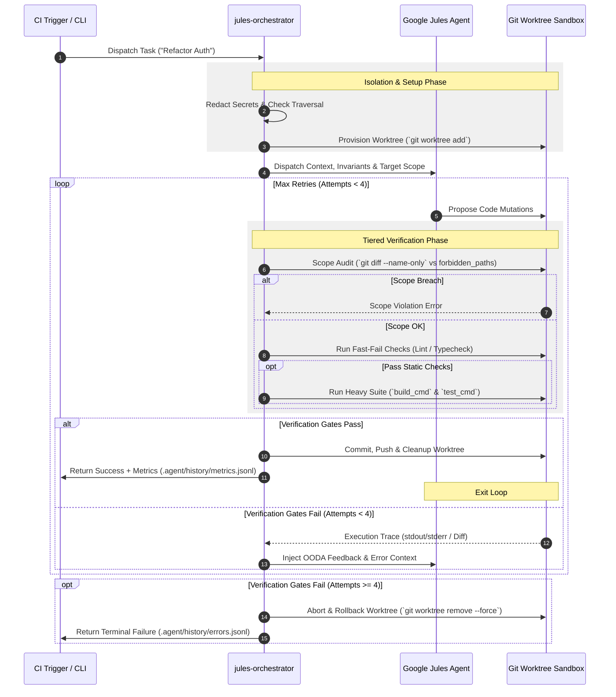

# Google Jules Orchestration Kit

[](https://www.npmjs.com/package/jules-orchestrator-kit)
[](https://opensource.org/licenses/MIT)
[](https://nodejs.org)
[](#)

A lightweight, zero-dependency toolkit for turning **Google Jules** into a deterministic, autonomous background code builder for any repository (Next.js, Vite, Node, Bun, Deno, Python, Go, Rust, Elixir, Ruby, Swift, Java, C/C++, Monorepos, etc.).

> **TL;DR**: Don't use Google Jules like a chat assistant. Use it as an autonomous background worker. Run `npx jules-orchestrator-kit` inside any repository to automatically detect your tech stack, generate prompt guardrails, set up test/build verification gates, and install Jules orchestration scripts.

---

## ⚡ 1-Step Quick Setup for Any Project

Run this command inside the root of **any target repository**:

```bash
npx jules-orchestrator-kit
# or launch interactive setup wizard
npx jules-init --interactive
```

---

## 🧠 Architecture: The Autonomous Loop



---

<details open>
<summary><b>💡 What This Toolkit Provides (8 Core Components)</b></summary>

1. **Init Scaffolding CLI (`bin/init.js`)**: Auto-scaffolds any repo using `node:util.parseArgs` with interactive TTY wizard (`-i, --interactive`) and silent CI fallback.
2. **Monorepo & Command Resolver (`scripts/command-resolver.mjs`)**: Auto-detects project manifests and monorepo workspace graphs (`turbo.json`, `pnpm-workspace.yaml`, `nx.json`, `Cargo.toml` workspaces) to run targeted affected package verifications (`git diff`) instead of full-repo test suites.
3. **Dynamic Guardrail Composition (`.agent/rules/dynamic-guardrails.json`)**: RegEx-based rule matching that injects targeted stack guardrails into prompts on-the-fly.
4. **Shannon Entropy Redaction & REST/stdin Dispatcher (`scripts/jules-dispatch.mjs`)**: Auto-redacts high-entropy secrets while preserving valid file paths, and supports dry-run testing (`JULES_DRY_RUN=1`).
5. **PR Self-Auditor & Self-Healing Gatekeeper (`scripts/jules-self-audit.mjs`)**: Unshallows git history in CI runners (`git fetch --unshallow`), enforces `forbidden_paths`, extracts OODA feedback error traces, and logs telemetry to `.agent/history/metrics.jsonl`.
6. **Transactional Queue Runner (`scripts/jules-queue-runner.mjs`)**: Iterates through `.agent/jules-queue/`, dispatches queued markdown tasks, moves completed tasks, and logs status transitions.
7. **Git Worktree Swarm Orchestrator (`scripts/jules-swarm.mjs`)**: Manages multi-task batches in isolated Git worktrees (`JULES_USE_WORKTREES=true`) with scope boundary isolation.
8. **Nightly Maintenance Suite (`scripts/jules-nightly.mjs`)**: Schedules automated background audits (security leak scans, WCAG accessibility checks, dead code pruning, unused env var cleanup).

</details>

---

<details>
<summary><b>🛠️ Supported Language Manifests & Workspace Graphs (15+ Tech Stacks)</b></summary>

| Stack / Ecosystem | Manifest / Workspace File | Default Verification Command |
|---|---|---|
| **Turborepo** | `turbo.json` | `npx turbo run test --filter=<pkg>...` |
| **pnpm Workspace** | `pnpm-workspace.yaml` | `pnpm --filter=...<pkg> test` |
| **Nx Workspace** | `nx.json` | `npx nx run-many -t test -p <pkg> --with-deps` |
| **Bun** | `bunfig.toml` / `bun.lockb` | `bun test && bun run build` |
| **Deno** | `deno.json` / `deno.jsonc` | `deno test && deno task build` |
| **JavaScript / TypeScript** | `package.json` | `npm run lint && npm test` (or `npm run check:all`) |
| **Rust** | `Cargo.toml` | `cargo test -p <pkg>` / `cargo test --workspace` |
| **Go** | `go.mod` | `go test ./... && go build ./...` |
| **Python** | `pyproject.toml` / `requirements.txt` | `pytest` |
| **Elixir** | `mix.exs` | `mix test && mix compile` |
| **Ruby** | `Gemfile` | `bundle exec rake test` |
| **Swift** | `Package.swift` | `swift test && swift build` |
| **Java (Maven)** | `pom.xml` | `mvn test && mvn compile` |
| **Java (Gradle)** | `build.gradle` | `./gradlew test && ./gradlew assemble` |
| **C / C++** | `Makefile` | `make test && make build` |
| **Custom Config (v2)** | `.agent/jules.yml` | Configurable `test_cmd`, `build_cmd`, `forbidden_paths` & `allow_paths` |

</details>

---

<details>
<summary><b>📖 Usage Examples & Workflows (Single Tasks, Swarms, Queue, Nightly)</b></summary>

### Dispatch a single task to Jules

```bash
# Dry-run test prompt payload locally without executing remote API/CLI
JULES_DRY_RUN=1 node scripts/jules-dispatch.mjs "Refactor rate limiter" "Implement sliding window rate limiting in src/utils/rate-limit.ts"

# Real dispatch
node scripts/jules-dispatch.mjs "Refactor rate limiter" "Implement sliding window rate limiting in src/utils/rate-limit.ts"
```

### Dispatch an entire queue of markdown task specifications

```bash
npm run jules:queue
```

### Run Rate-Limited Swarm with Scope Isolation

```bash
JULES_SWARM_CONCURRENCY=5 JULES_USE_WORKTREES=true node scripts/jules-swarm.mjs tasks.json
```

Where `tasks.json` supports file boundary `scope` segregation to prevent parallel task collisions:
```json
[
  { "id": "t1", "title": "Refactor Auth", "prompt": "Refactor auth middleware to ESM", "scope": ["src/auth/**"] },
  { "id": "t2", "title": "Fix Memory Leak", "prompt": "Fix listener memory leak in websocket event loop", "scope": ["src/ws/**"] }
]
```

### Run Nightly Maintenance Suite

```bash
node scripts/jules-nightly.mjs --dry-run
```

### Audit Jules PRs before merging

```bash
node scripts/jules-self-audit.mjs
```

</details>

---

<details>
<summary><b>🌐 Integration Interfaces: CLI, REST API & MCP Directives</b></summary>

`jules-orchestrator-kit` supports three primary integration channels:

### 1. Direct REST API Mode (`jules.googleapis.com`)
When `JULES_API_KEY` and `JULES_REPO` are present in your environment (`.env` or CI secrets), `scripts/jules-dispatch.mjs` dispatches payloads directly to the official Google Jules REST API endpoint:
```http
POST https://jules.googleapis.com/v1alpha/sessions
X-Goog-Api-Key: $JULES_API_KEY
Content-Type: application/json
```
- Handles HTTP 429 rate limits gracefully without falling back to CLI.
- Automatically maps `startingBranch` (`BASE_BRANCH` or `main`) and `sourceContext`.

### 2. Native Jules CLI Fallback (`jules new`)
If `JULES_API_KEY` is omitted or unconfigured, `jules-dispatch.mjs` seamlessly falls back to invoking the local `jules` CLI binary:
```bash
jules new --repo owner/repo
```
Prompts are piped directly via `stdin` to bypass OS `ARG_MAX` shell argument length limits.

### 3. MCP (Model Context Protocol) Directives
All task dispatches dynamically inject `<MCP_DIRECTIVE>` envelopes into task prompts:
```xml
<MCP_DIRECTIVE>
  <system_state>HEADLESS_CI_MODE</system_state>
  <strict_invariants>
    <rule>1. READ-BEFORE-WRITE: Inspect symbol definitions before editing.</rule>
    <rule>2. VERIFICATION LOOP: Execute test_cmd and build_cmd and pass with 0 errors.</rule>
    <rule>3. ABORT CONDITION: Terminate on 4+ repeated test failures.</rule>
    <rule>4. ASSERTION QUALITY: Unit tests created or modified MUST contain explicit assertions.</rule>
  </strict_invariants>
</MCP_DIRECTIVE>
```
This forces Jules to adhere to strict read-before-write invariants and deterministic execution when operating alongside MCP server tools.

</details>

---

<details>
<summary><b>⚙️ Configuration & Security (`.agent/jules.yml`)</b></summary>

```yaml
# Google Jules Repository Configuration (Version 2)
version: 2
test_cmd: "npm test"
build_cmd: "npm run build"
forbidden_paths:
  - ".github/**"
  - "**/secrets/**"
  - "**/*.pem"
  - "**/lock-manager/**"
  - "scripts/jules-*"
  - ".agent/jules.yml"
allow_paths: []
```

> 🛡️ **Security Trust Model**: `allow_paths` is read **strictly from the target base branch** (`origin/main`), never from untrusted PR branches. Any path specified in `allow_paths` on `main` overrides the immutable default forbidden paths for automated background workers.

</details>

---

<details>
<summary><b>🤝 Contributing & Code Guidelines</b></summary>

We welcome contributions! Please follow these core principles when submitting Pull Requests:

1. **Zero External Dependencies**: Keep the orchestrator engine 100% dependency-free. Use ONLY native Node.js built-in modules (`node:fs`, `node:path`, `node:child_process`, `node:crypto`, `node:util`).
2. **Verification Suite**: Ensure 100% of unit tests pass cleanly (`npm test`).
3. **Conventional Commits**: Use standardized commit message prefixes (`feat:`, `fix:`, `docs:`, `test:`, `chore:`).
4. **Cross-Platform Compatibility**: Always normalize Windows backslashes (`\`) to POSIX slashes (`/`) for glob patterns and paths.

</details>

---

## 📜 License & Disclaimer

MIT License - feel free to use, modify, and share!

*Disclaimer: This is an independent open-source orchestration tool and is not officially affiliated with or endorsed by Google.*
