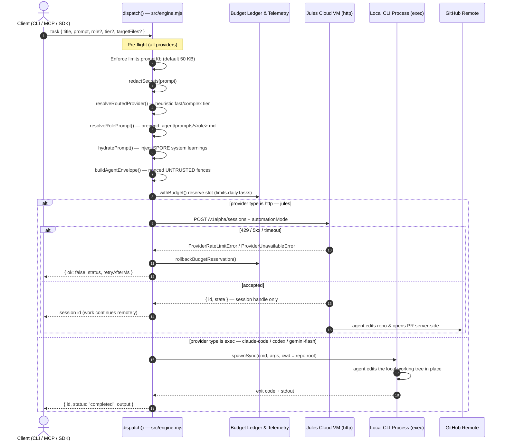
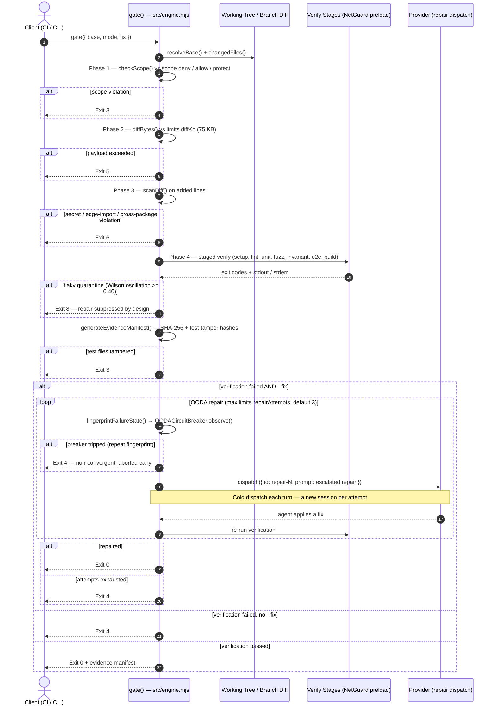

# Architecture & Pipeline Flow

`jules-orchestrator-kit` is **two decoupled pipelines**, not one linear flow:

1. **Dispatch** (`agentctl dispatch`, `task create` → `queue`) — routes, hydrates and envelopes a task, then hands it to a provider.
2. **Verification** (`agentctl gate [--fix]`) — audits a working tree or branch in four phases and, only with `--fix`, drives the OODA repair loop.

They communicate through the repository and the telemetry ledger, not through a shared call stack. `dispatch()` never invokes the gate, and `gate()` is what owns the OODA loop.

> [!IMPORTANT]
> **Where code changes land depends entirely on the provider type.** This is the single most important thing to understand before reading the diagrams below — the two modes execute in different machines.

---

## Provider Execution Models

`createProvider()` (`src/provider.mjs`) returns one of two fundamentally different adapters:

| | `type: "http"` — remote agent | `type: "exec"` — local agent |
| :--- | :--- | :--- |
| **Built-in presets** | `jules` | `claude-code`, `codex`, `gemini-flash` |
| **Transport** | `fetch()` → `POST https://jules.googleapis.com/v1alpha/sessions` | `spawnSync(command, args, { cwd: config._root, shell: false })` |
| **Where the agent runs** | Google's Cloud VM, against the **connected GitHub repo** | This machine, in the **local checkout** |
| **What touches your files** | Nothing locally. The orchestrator never sees the edit. | The spawned CLI writes directly to the working tree. |
| **Return value** | Session handle `{ id, status }` — work continues asynchronously | `{ id, status: "completed", output }` — work is already done |
| **Who opens the PR** | **Jules does**, server-side, when `automationMode: "AUTO_CREATE_PR"` is set in the request body (`src/provider.mjs`) | Nobody — no PR is created |
| **Credentials** | `JULES_API_KEY` via `X-Goog-Api-Key` header | Provider CLI's own auth (e.g. `GEMINI_API_KEY`) |

`automationMode` is written into the HTTP body only, so it has no meaning for exec providers.

---

## Pipeline A — Task Dispatch

`dispatch()` in `src/engine.mjs`. Note that it performs **no git operations at all**: no worktree, no branch, no commit, no push.

When the router is enabled, a `fast`-tier task is dispatched through `createFailoverProvider([fast, complex])`, so a rate-limited fast provider transparently cascades to the primary one.

---

## Pipeline B — Verification Gate & OODA Repair

`gate()` in `src/engine.mjs`. This runs against whatever is already in the tree — typically in CI against a PR branch (including one Jules opened), or locally after an exec provider has finished. Phases short-circuit: the first failure returns immediately.

### On warm session resumption

`provider.resume()` targets `POST /v1alpha/sessions/{id}:sendMessage` with a fail-soft cold-dispatch fallback on HTTP 400/404. It is reached from **`agentctl resume <sessionId> --response "…"`** — the asynchronous human-in-the-loop path — and from `createFailoverProvider`'s delegating wrapper.

The automatic OODA loop above does **not** use it: `repair()` calls `provider.dispatch()` with a fresh `{ id: "repair-N" }` task on every attempt. Each repair turn is therefore a cold session. `synthesizePrDescription()` reads `session._warmResumed` / `session._warmAttempts`, but nothing in the current code path ever sets them.

---

## Verification Gate Phases

Every phase runs against `origin/<base>` rules and short-circuits on first failure.

| Phase | Component | Enforcement | Exit code |
| :--- | :--- | :--- | :--- |
| **1. Scope** | `checkScope()` (`src/security.mjs`) | Modified + untracked files vs `scope.deny` → `scope.allow` → `scope.protect`. Deny is evaluated first and unconditionally, against a path canonicalised by `canonicalizePath()` and matched **case-insensitively**; paths escaping the repo root are rejected outright. Allow stays case-sensitive so a mismatch fails closed. | `3` |
| **2. Payload** | `diffBytes()` (`src/git.mjs`) | Inclusive `<=` against `limits.diffKb * 1024` (default 75 KB), measured in UTF-8 bytes. | `5` |
| **3. Diff Scan** | `scanDiff()` (`src/security.mjs`) | Three independent checks folded into one phase — see below. | `6` |
| **4. Verify** | Staged runner + `preload-net-guard.mjs` | Runs the configured stages as sub-processes with a `NODE_OPTIONS` network guard, honouring `verify.policy.networkAccess`. | `4` (or `8` on flaky quarantine) |
| **5. Evidence** | `generateEvidenceManifest()` (`src/evidence.mjs`) | SHA-256 manifest of changed files plus pre/post test-file hashes; a mismatch means tests were edited to force a pass. | `3` |

### Phase 3 is a diff scanner, not only a secret scanner

`scanDiff()` reduces the diff to added lines (`+`, excluding `+++` headers) and emits three finding types, all severity `HIGH`/`CRITICAL` and all mapping to exit `6`:

| Finding type | Detector |
| :--- | :--- |
| `HIGH_CONFIDENCE_SECRET` / `LOW_CONFIDENCE_SECRET` | Regex pattern lists (AWS, GitHub, OpenAI, Stripe, private keys, bearer tokens) — **pattern matching, not entropy**. Run against three variants of the added lines: as-written, with invisible characters stripped, and with source-level string concatenation collapsed |
| `EDGE_RUNTIME_VIOLATION` | `checkEdgeRuntimeImports()` — unsupported `node:*` built-ins in Cloudflare / Vercel / Netlify Edge contexts |
| `CROSS_PACKAGE_BOUNDARY_VIOLATION` | `checkCrossPackageImports()` — illegal cross-package imports in a monorepo |

### Shannon entropy thresholds

Entropy is **not** used by the Phase 3 gate. Three different thresholds exist in three different components:

| Threshold | Location | Purpose |
| :--- | :--- | :--- |
| `> 3.6` | `redactSecrets()` (`src/security.mjs`) | Decides which **environment variable values** get masked in log and diff output |
| `> 4.3` | `planTaskCreate()` (`src/wizard-task.mjs`) | Flags a high-entropy **token** inside a task prompt pre-dispatch |
| `> 4.5` | `planTaskCreate()` (`src/wizard-task.mjs`) | Flags a short prompt that is high-entropy **in aggregate** |

---

## Exit Code Registry

| Code | Meaning |
| :--- | :--- |
| `0` | Success — verification passed. |
| `1` | Pre-dispatch / argument failure; prompt exceeds `limits.promptKb`. |
| `2` | Provider API failure — HTTP 429, 5xx, or timeout. |
| `3` | Scope violation, **or** test-file tampering detected by the evidence manifest. |
| `4` | Verification failed — OODA repair exhausted, not run, or aborted early by the circuit breaker. |
| `5` | Diff payload exceeds `limits.diffKb`. |
| `6` | Phase 3 finding — secret, edge-runtime import, or cross-package boundary violation. |
| `7` | Daily task quota (`limits.dailyTasks`) exhausted. |
| `8` | Flaky test quarantined (Wilson-score oscillation >= 0.40); OODA repair suppressed deliberately. |

---

## What the Orchestrator Does Not Do

Stated explicitly, because earlier revisions of this document described machinery that does not exist:

- **It does not provision git worktrees.** `src/git.mjs` exports `worktreeRemove()` and `worktreePrune()` — cleanup utilities used by `agentctl clean` to reap worktrees created by external swarm tooling. Nothing in the codebase runs `git worktree add`.
- **It does not commit, push, or open pull requests.** For `type: "http"`, Jules does this server-side via `automationMode`. For `type: "exec"`, the changes are simply left in the working tree for you to review.
- **`run()` does not verify.** It dispatches each queued task, moves the envelope to `.agent/jules-queue/completed/`, and appends to the ledger. Verification is a separate `agentctl gate` invocation.
- **The OODA loop is a property of `gate --fix`, not of dispatch.** A plain `agentctl dispatch` never self-heals.
