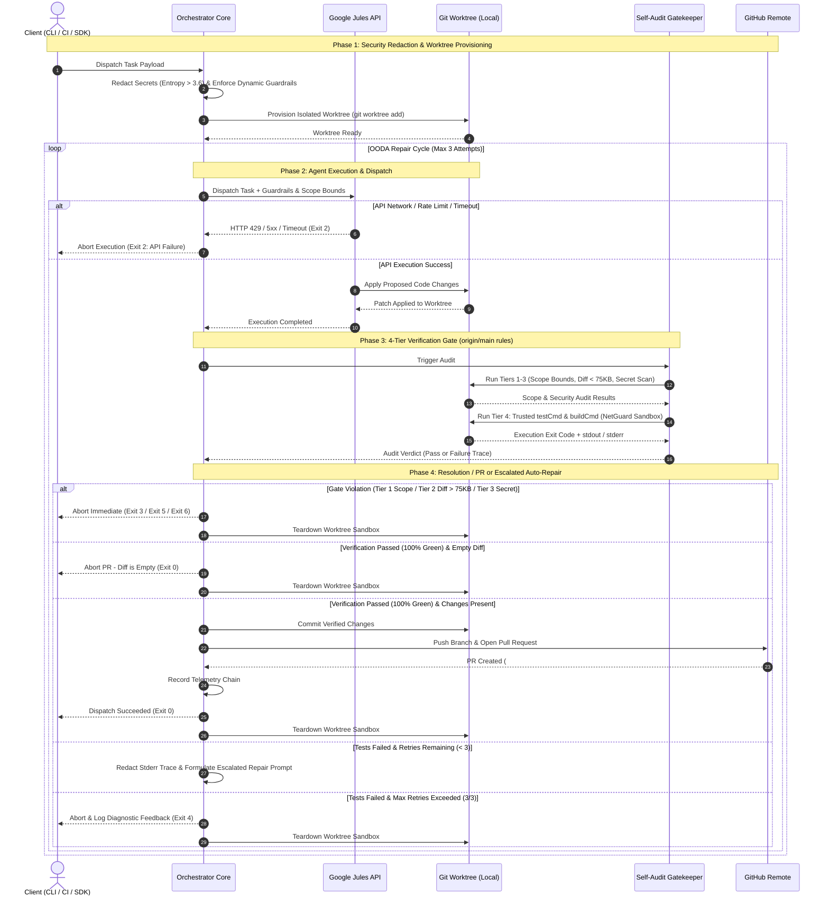

# Architecture & Pipeline Flow

The Google Jules Orchestrator Kit is built to safely and automatically execute task boundaries, test code changes, and loop through an OODA (Observe, Orient, Decide, Act) cycle before finally opening a verified Pull Request.

---

## Autonomous Orchestration Sequence

---

## 4-Tier Gatekeeper Architecture

Every proposed patch must clear all 4 verification tiers before entering remote SCM:

| Tier | Gatekeeper Component | Enforcement | Exit Code on Failure |
| :--- | :--- | :--- | :--- |
| **Tier 1** | **Scope Audit** | Compares modified + untracked files against `.agent/config.yml` `scope.deny` patterns. | `3` (Scope Violation) |
| **Tier 2** | **Diff Governor** | Ensures cumulative diff payload does not exceed budget (`75 KB`). | `5` (Diff Payload Limit) |
| **Tier 3** | **Secret Scanner** | High-entropy Shannon scanning (`entropy > 3.6`) and pattern detection (AWS, OpenAI, GitHub tokens). | `6` (Secret Leak Prevented) |
| **Tier 4** | **Test & Build Sandbox** | Executes project test and build oracles (`testCmd`, `buildCmd`) inside sandboxed sub-process. | `4` (OODA Exhausted on 3 fails) |

