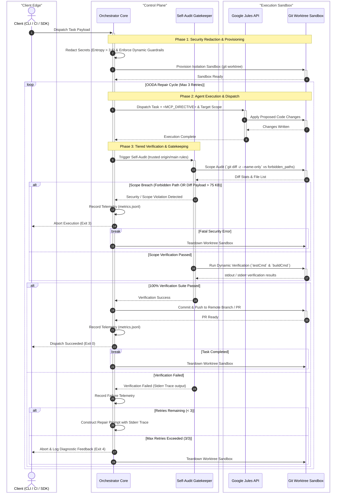

# Architecture & Pipeline Flow

The Google Jules Orchestrator Kit is built to safely and automatically execute task boundaries, test code changes, and loop through an OODA (Observe, Orient, Decide, Act) cycle before finally creating a Pull Request.

## Detailed Sequence Diagram

