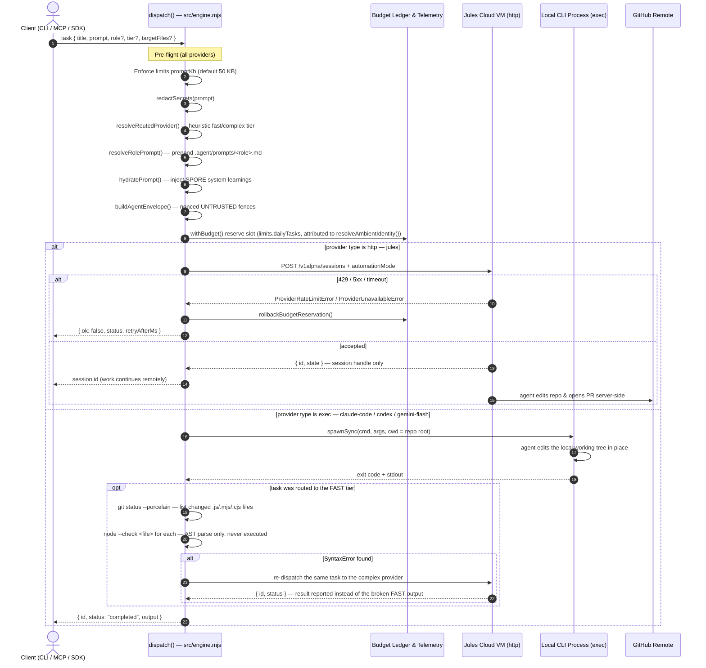
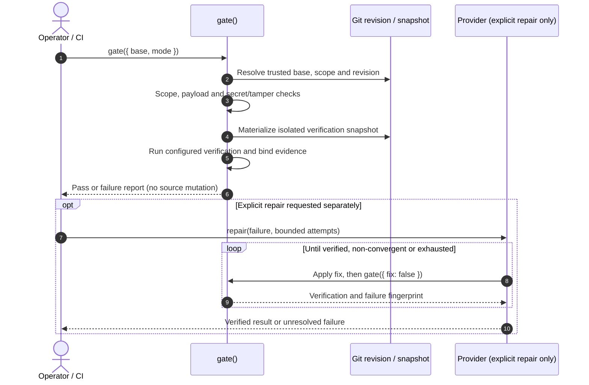
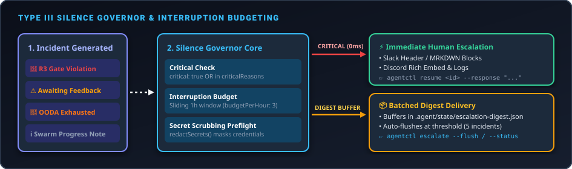
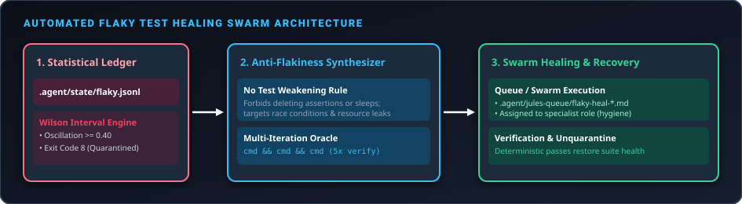
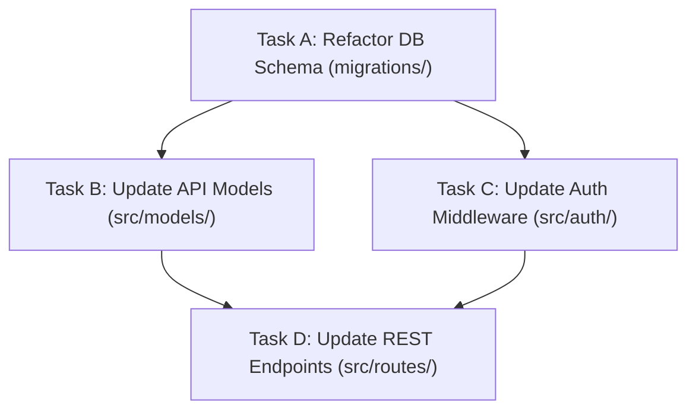

# Architecture & Pipeline Flow

`jules-orchestrator-kit` is **two decoupled pipelines**, not one linear flow:

1. **Dispatch** (`agentctl dispatch`, `task create` → `queue`) — routes, hydrates and envelopes a task, then hands it to a provider.
2. **Verification** (`agentctl gate`) — audits a working tree or branch without mutating source code. Repair is an explicit separate operation.

They communicate through the repository and the telemetry ledger, not through a shared call stack. `dispatch()` never invokes the gate; `repair()` owns the bounded OODA loop and calls `gate()` to verify each attempt.

> [!IMPORTANT]
> **Where code changes land depends entirely on the provider type.** This is the single most important thing to understand before reading the diagrams below — the two modes execute in different machines.

---

## Provider Execution Models

`createProvider()` (`src/provider.mjs`) returns one of two fundamentally different adapters:

| | `type: "http"` — remote agent | `type: "exec"` — local agent |
| :--- | :--- | :--- |
| **Built-in presets** | `jules` | `claude-code`, `codex`, `gemini-flash` |
| **Transport** | `fetch()` → `POST https://jules.googleapis.com/v1alpha/sessions` | `spawnSync(command, args, { cwd: config._root, shell: false })` |
| **Where the agent runs** | Google's Cloud VM, against the **connected GitHub repo** | This machine, in the **local checkout** |
| **What touches your files** | Nothing locally. The orchestrator never sees the edit. | The spawned CLI writes directly to the working tree. |
| **Return value** | Session handle `{ id, status }` — work continues asynchronously | `{ id, status: "completed", output }` — work is already done |
| **Who opens the PR** | **Jules does**, server-side, when `automationMode: "AUTO_CREATE_PR"` is set in the request body (`src/provider.mjs`) | Nobody — no PR is created |
| **Credentials** | `JULES_API_KEY` via `X-Goog-Api-Key` header | Provider CLI's own auth (e.g. `GEMINI_API_KEY`) |

`automationMode` is written into the HTTP body only, so it has no meaning for exec providers.

---

## Pipeline A — Task Dispatch

`dispatch()` in `src/engine.mjs` prepares the task and optionally records a pre-dispatch Git checkpoint. It does not create a working branch, commit, push, or run the verification gate.



When the router is enabled, a `fast`-tier task is dispatched through `createFailoverProvider([verifiedFast, complex])`, so a rate-limited fast provider transparently cascades to the primary one. The `fast` leg of that cascade is itself wrapped by `createSyntaxVerifiedProvider()` (`src/provider.mjs`), which is a second, independent escalation path: even a `200`/exit-`0` result from the fast tier gets its locally-changed `.js`/`.mjs`/`.cjs` files parsed with `node --check` before being trusted, and a verified syntax failure re-dispatches through the primary provider transparently. This only inspects files an **exec**-type provider mutated in the local working tree; a fast tier pointed at a remote HTTP provider has nothing local to check and the gate is a no-op.

---

## Pipeline B — Non-mutating verification and explicit repair

`gate()` verifies the selected working tree or revision. It always forces `fix: false`:
verification failure is reported, not repaired behind the operator's back.
`repair()` is a separate explicit, bounded operation; it uses `gate()` after
each attempt and stops on repeated failure fingerprints.



### On warm session resumption

`provider.resume()` targets `POST /v1alpha/sessions/{id}:sendMessage`, with a
fail-soft cold-dispatch fallback on HTTP 400/404. `agentctl resume` is the
human-in-the-loop path. The bounded OODA repair path currently cold-dispatches
each retry via `provider.dispatch()`; it does not claim warm-session reuse.

### Evidence-grounded preflight

`dispatch --check-premise` never treats a passing generic `--verify-cmd` or
envelope verification command as proof that a new feature already exists.
To allow `ALREADY_SATISFIED`, explicitly supply `--goal-check <command>` that
returns zero only when the requested outcome is present. The check must be
non-placeholder, distinct from generic verification, and pass on an unchanged
clean Git revision. Otherwise dispatch proceeds. Its decision and bounded
evidence (revision, command hash, exit code and duration) are recorded as
`dispatch_decision` telemetry. A dry run does not execute the goal check.

Example:

```sh
agentctl dispatch --prompt "Add feature X" --verify-cmd "npm test" \
  --check-premise --goal-check "node scripts/check-feature-x.mjs"
```
---

## Pipeline C — Type III Silence Governor & Interruption Budgeting

`dispatchEscalation()` and `flushEscalationDigest()` in `src/webhook.mjs`.

Protects developer attention by buffering non-critical notifications while guaranteeing zero-latency delivery for critical escalations.

<p align="center">
  
</p>

1. **Critical Bypass (0ms)**: Incidents matching `DEFAULT_CRITICAL_REASONS` (`R3_GATE_VIOLATION`, `SECRET_LEAK_DETECTED`, `CRITICAL_FAILURE`) or carrying `critical: true` are dispatched immediately to configured Slack/Discord endpoints. The list stays short on purpose: a reason belongs on it only when *delay widens the damage*. `AWAITING_USER_FEEDBACK` is not on it — a blocked agent is the most frequent escalation on a swarm and the exact case the governor exists to batch. Override with `notifications.critical_reasons`.
2. **Interruption Budget**: Immediate non-critical alerts are throttled to `notifications.budgetPerHour` (default 3) via a sliding 1-hour window in `.agent/state/interruption-ledger.json`. The allowance is charged when an alert is actually sent — never for a `--dry-run` preview or a repo with no webhook configured.
3. **Digest Mode & Batch Flush**: When `notifications.mode` is set to `"digest"`, non-critical incidents buffer in `.agent/state/escalation-digest.json` and auto-flush upon reaching `threshold` (default 5) or via explicit operator trigger (`agentctl escalate --flush`). A flush carries at most `DIGEST_BATCH_LIMIT` (10) incidents — what Slack and Discord will actually render — and leaves the rest buffered. The buffer is emptied only by a delivery that succeeded, so a failed webhook or a preview loses nothing.
4. **Secret Scrubbing**: All error logs are scrubbed with `redactSecrets()` before formatting webhook markdown blocks.

---

## Pipeline D — Statistical Flaky Test Healing Swarm

`listQuarantinedTests()` and `runFlakyHealingSwarm()` in `src/flaky-ledger.mjs`.

Consumes Wilson-Score quarantined test suites (Exit Code 8) and executes targeted remediation without test assertion weakening.

<p align="center">
  
</p>

1. **Wilson-Score Statistical Quarantine**: When a test command oscillates across consecutive verification runs ($\ge 0.40$ state transitions) and its Wilson confidence interval is interior ($0 < \text{lower} \text{ and } \text{upper} < 1$), `flakyVerdict()` quarantines the command with Exit Code 8.
2. **Anti-Flakiness Task Synthesis**: `synthesizeFlakyHealingTask()` creates an envelope with:
   - **Strict Invariant: No Test Weakening**: Deleting failing assertions, commenting out checks, or adding arbitrary broad sleep calls is strictly forbidden.
   - Specific remediations for condition-based assertions, port collisions, and clean teardown hooks.
   - Multi-iteration verification oracle (`cmd && cmd && cmd`).
3. **Swarm Execution**: Queues tasks into `.agent/jules-queue/flaky-heal-*.md` for swarm workers (`agentctl flaky heal`).

---

## Pipeline E — DAG Task Queue Execution & Dependency Resolution

`executeQueueDag()` in `src/dag-engine.mjs`.

Resolves inter-task dependencies for tasks authored with `--depends-on <id,...>`.



1. **Task Selection by Shape**: A queue-directory entry is executed only if it *is* a task: a `.md` file passing `isTaskFile`, a `.task` file, or a `.json` object carrying a non-empty `prompt` that is not a `tasks`/`envelopes` container. Manifests and the queue's own `README.md` are skipped and left in place.
2. **Kahn's Topological Sort**: Parses task frontmatter envelopes in `.agent/jules-queue/` and calculates dependency execution order.
3. **Cycle Detection**: Automatically rejects cyclic dependencies (`DagCycleError`) before starting execution.
4. **DAG Concurrency Slots**: Executes unblocked leaf tasks in parallel while ensuring downstream tasks wait for dependency completion.

---

## Verification Gate Phases

Every phase runs against `origin/<base>` rules and short-circuits on first failure.

| Phase | Component | Enforcement | Exit code |
| :--- | :--- | :--- | :--- |
| **1. Scope** | `checkScope()` (`src/scope-guard.mjs`, re-exported by `src/security.mjs`) | Modified + untracked files vs `scope.deny` → `scope.allow` → `scope.protect`. Deny is evaluated first and unconditionally, against a path canonicalised by `canonicalizePath()` and matched **case-insensitively**; paths escaping the repo root are rejected outright. Allow stays case-sensitive so a mismatch fails closed. | `3` |
| **2. Payload** | `diffBytes()` (`src/git.mjs`) | Inclusive `<=` against `limits.diffKb * 1024` (default 75 KB), measured in UTF-8 bytes. | `5` |
| **3. Diff Scan** | `scanDiff()` (`src/security.mjs`) | Three independent checks folded into one phase — see below. `scanDiff()` is the orchestrator; the detectors it calls live in `src/secret-scanner.mjs`, `src/test-tamper-guard.mjs` and `src/bidi-guard.mjs`, all re-exported from `src/security.mjs`. | `6` |
| **4. Verify** | Staged runner + `preload-net-guard.mjs` | Runs the configured stages as sub-processes with a `NODE_OPTIONS` network guard, honouring `verify.policy.networkAccess`. | `4` (or `8` on flaky quarantine) |
| **5. Evidence** | `generateEvidenceManifest()` (`src/evidence.mjs`) | SHA-256 manifest of changed files plus pre/post test-file hashes; a mismatch means tests were edited to force a pass. | `3` |

### Phase 3 is a diff scanner, not only a secret scanner

`scanDiff()` reduces the diff to added lines (`+`, excluding `+++` headers) and emits three finding types, all severity `HIGH`/`CRITICAL` and all mapping to exit `6`:

| Finding type | Detector |
| :--- | :--- |
| `HIGH_CONFIDENCE_SECRET` / `LOW_CONFIDENCE_SECRET` | Regex pattern lists (AWS, GitHub, OpenAI, Stripe, private keys, bearer tokens) — **pattern matching, not entropy**. Run against three variants of the added lines: as-written, with invisible characters stripped, and with source-level string concatenation collapsed |
| `HIGH_CONFIDENCE_SECRET` (encoded) | `hasEncodedSecret()` (`src/secret-scanner.mjs`) — base64 blobs on added lines are decoded and matched, so a key in a Kubernetes `Secret` manifest or a base64'd `.env` is not invisible to a line-oriented scanner. The description names the encoding; the type is deliberately the same, so every gate that already blocks on a cleartext key blocks on this one |
| `EDGE_RUNTIME_VIOLATION` | `checkEdgeRuntimeImports()` — unsupported `node:*` built-ins in Cloudflare / Vercel / Netlify Edge contexts |
| `CROSS_PACKAGE_BOUNDARY_VIOLATION` | `checkCrossPackageImports()` — illegal cross-package imports in a monorepo |

**Decoded bytes are matched against the high-confidence patterns only.** The low-confidence set is entropy- and keyword-driven, and decoded output is high-entropy by construction, so running it there would flag close to every encoded blob in every repository. `AKIA[0-9A-Z]{16}` cannot match decoded noise; "looks secret-ish" always can. Candidates are filtered by length-modulo-four and then by whether the decode is ≥ 90% printable ASCII — `Buffer.from(s, "base64")` never throws, it silently discards what it cannot parse, so a hex digest of the right length "decodes" into bytes that mean nothing. Work is capped at 64 candidates and 64 KB decoded per scan; an oversized blob is skipped rather than ending the scan, so a checked-in binary cannot hide a real key that follows it.

### Shannon entropy thresholds

Entropy is **not** used by the Phase 3 gate. Three different thresholds exist in three different components:

| Threshold | Location | Purpose |
| :--- | :--- | :--- |
| `> 3.6` | `redactSecrets()` (`src/secret-scanner.mjs`) | Decides which **environment variable values** get masked in log and diff output |
| `> 4.3` | `planTaskCreate()` (`src/wizard-task.mjs`) | Flags a high-entropy **token** inside a task prompt pre-dispatch |
| `> 4.5` | `planTaskCreate()` (`src/wizard-task.mjs`) | Flags a short prompt that is high-entropy **in aggregate** |

---

## Exit Code Registry

| Code | Meaning |
| :--- | :--- |
| `0` | Success — verification passed. |
| `1` | Pre-dispatch / argument failure; prompt exceeds `limits.promptKb`. |
| `2` | Provider API failure — HTTP 429, 5xx, or timeout. |
| `3` | Scope violation, **or** test-file tampering detected by the evidence manifest. |
| `4` | Verification failed — OODA repair exhausted, not run, or aborted early by the circuit breaker. |
| `5` | Diff payload exceeds `limits.diffKb`. |
| `6` | Phase 3 finding — secret, edge-runtime import, or cross-package boundary violation. |
| `7` | Daily task quota (`limits.dailyTasks`) exhausted. |
| `8` | Flaky test quarantined (Wilson-score oscillation >= 0.40); OODA repair suppressed deliberately. |

---

## What the Orchestrator Does Not Do

Stated explicitly, because earlier revisions of this document described machinery that does not exist:

- **It does not provision git worktrees.** `src/git.mjs` exports `worktreeRemove()` and `worktreePrune()` — cleanup utilities used by `agentctl clean` to reap worktrees created by external swarm tooling. Nothing in the codebase runs `git worktree add`.
- **It does not commit, push, or open pull requests.** For `type: "http"`, Jules does this server-side via `automationMode`. For `type: "exec"`, the changes are simply left in the working tree for you to review.
- **`run()` does not verify.** It dispatches each queued task, moves the envelope to `.agent/jules-queue/completed/`, and appends to the ledger. Verification is a separate `agentctl gate` invocation.
- **`--dry-run` writes nothing.** It previews the dispatch of every queued task and then leaves the filesystem exactly as it found it — no move to `completed/`, no directory creation, no ledger entry — so the same queue can be previewed repeatedly.
- **The OODA loop is a property of `gate --fix`, not of dispatch.** A plain `agentctl dispatch` never self-heals.
